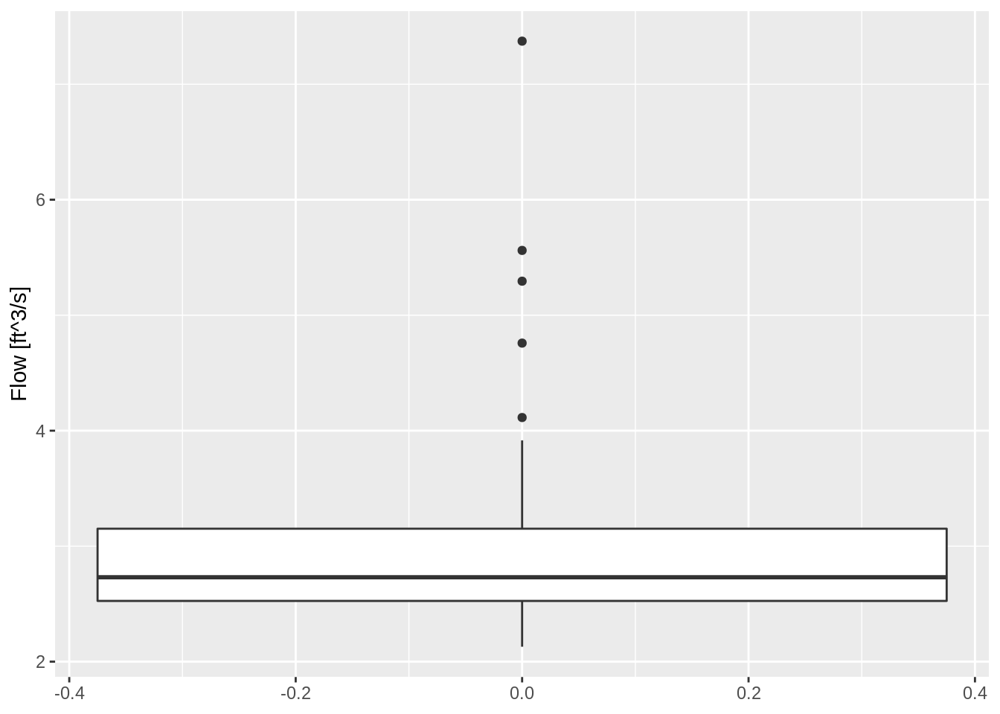
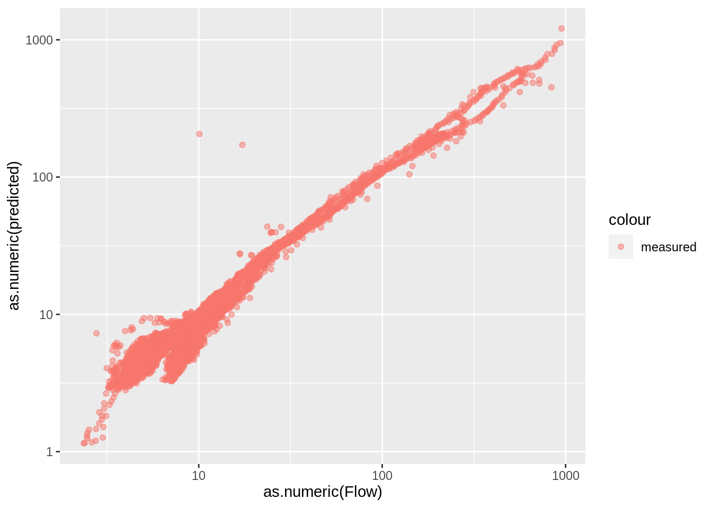

## About

This document is an exploratory analysis of the pressure data and IQ data at ...


```r
library(readr)
library(tibble)
library(dplyr)
library(ggplot2)
library(stringr)
library(here)
library(units)
library(ggforce)
library(hrbrthemes)
library(lubridate)
library(purrr)


update_geom_font_defaults(font_rc)

theme_ms <- function(...) {
  theme_ipsum_pub(plot_margin = margin(10,10,10,10),
              axis_title_just = "c") +
    theme(legend.position = "bottom",
          panel.background = element_rect(fill = "white", 
            colour = NA), 
          panel.border = element_rect(fill = NA, 
            colour = "grey20"),
          ...)
}
```


## Data Import

### Pressure Transducers

Use `readr::read_csv()` to import data. The HOBO pressure data is pre-computed but has extra lines we need to clean up.

- each location has two files, March through August and August through December.

- ideally, I can make one dataframe that compiles all the data

- we can read all the files and row bind but we need to add a column indicating the site number

- for this deployment it looks like the daylight savings time adjustment is not applied to data. So everything between March 6 and November 1 is off 1 hour from DST. Assuming all data will be reported in observed time, it is probably easiest to convert time back to GMT, then apply R's built in time zones to convert the times with appropriate -5 or -6 hour offsets.


```r
## make a list of files to import
file_paths <- paste0(here("Data/Hobo"),
                     "/",
                     list.files(path = here("Data/Hobo"),
                                pattern = ".csv"))

## create a blank tibble to fill
hobo_df <- tibble()


## loop through file paths to read each file
for (i in file_paths) {
  x <- read_csv(
    i,
    skip = 2,
    col_names = c(
      "Row",
      "Date",
      "Time",
      "Abs_Pres",
      "Temp",
      "Bar_Pressure",
      "Water_Level",
      "Coupler_Detached",
      "Coupler_Attached",
      "Stopped",
      "EOF"
    ),
    col_types = "nccnnnncccc"
  )
  x$file <- i
  hobo_df <- bind_rows(hobo_df, x)
  rm(x)
}

## clean up the dataframe
hobo_df <- hobo_df %>%
  mutate(
    ## regex extracts site number from file path
    Site = str_extract(file, "\\d{1,6}"),
    
    ## convert date and time columns to date/time format
    dt = paste(Date, Time),
    Date_Time = as.POSIXct(paste(Date, Time),
                           tz = "Etc/GMT-6",
                           format = "%m/%d/%y %I:%M:%S %p")) %>%
  mutate(Site = as.factor(Site)) %>%
  ## select the columns we need to keep
  dplyr::select(Abs_Pres, Temp, Water_Level, Site, Date_Time) %>%
  ## filter rows without water_level
  dplyr::filter(!is.na(Water_Level))
  
## attach units to our columns
units(hobo_df$Water_Level) <- as_units("ft")
units(hobo_df$Temp) <- as_units("°F")
units(hobo_df$Abs_Pres) <- as_units("psi")

  
hobo_df
```

```
## # A tibble: 71,447 x 5
##    Abs_Pres   Temp Water_Level Site  Date_Time          
##       [psi]   [°F]        [ft] <fct> <dttm>             
##  1  14.4270 76.006       0.392 16396 2020-03-02 15:17:19
##  2  14.4237 75.659       0.388 16396 2020-03-02 15:32:19
##  3  14.4272 75.312       0.399 16396 2020-03-02 15:47:19
##  4  14.4192 74.964       0.391 16396 2020-03-02 16:02:19
##  5  14.4165 74.791       0.379 16396 2020-03-02 16:17:19
##  6  14.4153 74.446       0.361 16396 2020-03-02 16:32:19
##  7  14.4172 74.271       0.364 16396 2020-03-02 16:47:19
##  8  14.4166 74.098       0.363 16396 2020-03-02 17:02:19
##  9  14.4207 73.926       0.372 16396 2020-03-02 17:17:19
## 10  14.4270 73.753       0.376 16396 2020-03-02 17:32:19
## # … with 71,437 more rows
```

### IQ Plus

```r
#read_csv(here::here("Data/IQPlus/16397-2020_12_31.csv"))

## make a list of files to import
file_paths <- paste0(here("Data/IQPlus"),
                     "/",
                     list.files(path = here("Data/IQPlus"),
                                pattern = ".csv"))

## create a blank tibble to fill
iqplus_df <- tibble()

## loop through file paths to read each file
for (i in file_paths) {
  x <- read_csv(
    i,
    col_types = "nc______n__n______________________nn______n_________"
  )
  x$file <- i
  iqplus_df <- bind_rows(iqplus_df, x)
  rm(x)
}


iqplus_df <- iqplus_df %>%
    mutate(
    ## regex extracts site number from file path
    Site = str_extract(file, "\\d{1,6}")) %>%
  ## use `dplyr::` to specify which rename function to use, just in case
  dplyr::rename(Sample_Number =`Sample number`,
                Date_Time = `Sample time`,
                Depth = `Depth (ft)`,
                Flow = `Flow (ft³/s)`,
                System_In_Water = `System in water (%)`,
                System_Status = `System status (status codes)`,
                Index_Velocity = `Velocity (mean) (ft/s)`) %>%
  dplyr::select(-c(Sample_Number, file)) %>%
  mutate(Date_Time = as.POSIXct(Date_Time,
                                tz = "Etc/GMT-6",
                                format = "%Y-%m-%d %H:%M:%S"))


## attach units to our columns
units(iqplus_df$Depth) <- as_units("ft")
units(iqplus_df$Flow) <- as_units("ft^3/s")
units(iqplus_df$Index_Velocity) <- as_units("ft/s")

iqplus_df
```

```
## # A tibble: 41,625 x 7
##    Date_Time              Depth     Flow System_In_Water System_Status
##    <dttm>                  [ft] [ft^3/s]           <dbl>         <dbl>
##  1 2020-05-12 16:58:00 1.758559 17.25626             100             0
##  2 2020-05-12 17:13:00 1.867973 20.86921             100             0
##  3 2020-05-12 17:28:00 2.006131 27.27231             100             0
##  4 2020-05-12 17:43:00 2.119382 31.04828             100             0
##  5 2020-05-12 17:58:00 2.172015 33.71041             100             0
##  6 2020-05-12 18:13:00 2.228058 36.78339             100             0
##  7 2020-05-12 18:28:00 2.350440 44.18084             100             0
##  8 2020-05-12 18:43:00 2.508431 51.30917             100             0
##  9 2020-05-12 18:58:00 2.674151 60.84247             100             0
## 10 2020-05-12 19:13:00 2.809936 69.92496             100             0
## # … with 41,615 more rows, and 2 more variables: Index_Velocity [ft/s],
## #   Site <chr>
```


## Data Explore

### Pressure Transducers

Plot the depth date over time for all three sites


```r
## note, that if the scale name has a space, there is a bug in ggforce
## need to set units_options(parse = FALSE) per:
## https://github.com/thomasp85/ggforce/issues/197

ggplot(hobo_df) +
  geom_line(aes(Date_Time, Water_Level, color = Site)) +
  scale_y_unit(name = "Level", unit = "ft") +
  scale_x_datetime(name = "Date/Time") +
  labs(title = "15-Minute Measured Height") +
  theme_ms()
```


## IQPlus

Plot the depth data drom the IQPlus from all three sites.


```r
iqplus_df %>%
  filter(System_Status == 0,
         System_In_Water == 100) %>%
  ggplot() +
  geom_point(aes(Date_Time, Depth, color = Site)) +
  facet_wrap(~Site, scales = "free") +
  labs(title = "Stage") +
  theme_ms()
```


Plot the depth-discharge from all three sites as measured by the IQPlus.


```r
iqplus_df %>%
  filter(System_Status == 0,
         System_In_Water == 100,
         as.numeric(Flow) > 0) %>%
  ggplot() +
  geom_point(aes(Depth, Flow, color = Site)) +
  scale_y_unit(name = "Flow", unit = "ft^3/s") +
  facet_wrap(~Site, scales = "free") +
  labs(title = "Stage Discharge") +
  theme_ms()
```


```r
iqplus_df %>%
  filter(System_Status == 0,
         System_In_Water == 100) %>%
  mutate(Month = lubridate::month(Date_Time, label = TRUE)) %>%
  ggplot() +
  geom_point(aes(Depth, Flow, color = Month), alpha = 0.5) +
  scale_y_unit(name = "Flow", unit = "ft^3/s") +
  facet_wrap(~Site, scales = "free") +
  labs(title = "Stage Discharge") +
  theme_ms()
```


Site `16396` looks pretty good. We still have some data cleaning and sorting on the remaining two sites.


Exploring `16397` further...


```r
iqplus_df %>%
  filter(Site == "16397",
         System_Status == 0,
         System_In_Water == 100,
         #as.numeric(Depth) >= 0.75,
         as.numeric(Flow) > 0) %>%
  mutate(Month = lubridate::month(Date_Time, label = TRUE)) %>%
  ggplot() +
  geom_point(aes(Depth, Flow, color = Month), alpha = 0.5) +
  scale_y_unit(name = "Flow", unit = "ft^3/s") +
  facet_wrap(~Month) +
  labs(title = "Stage Discharge") +
  theme_ms() +
  theme(panel.spacing = unit(2, "points"))
```


Exploring `16882` further...


```r
iqplus_df %>%
  filter(Site == "16882",
         System_Status == 0,
         System_In_Water == 100,
         as.numeric(Flow) > 0) %>%
  mutate(Month = lubridate::month(Date_Time, label = TRUE)) %>%
  ggplot() +
  geom_point(aes(Depth, Flow, color = Month), alpha = 0.5) +
  scale_y_unit(name = "Flow", unit = "ft^3/s") +
  facet_wrap(~Month) +
  labs(title = "Stage Discharge") +
  theme_ms() +
  theme(panel.spacing = unit(2, "points"))
```


The looped rating curve in May and Dec might be a flood flow event. Discharge is typically higher on the rising stage than the falling stage.


```r
iqplus_df %>%
  filter(Site == "16397",
         System_Status == 0,
         System_In_Water == 100,
         as.numeric(Depth) >= 0.26, ## minimum operating depth
         as.numeric(Flow) > 0) %>%
  filter(Date_Time <= as.POSIXct("2020-07-01")) %>%
  ggplot() +
  geom_point(aes(Date_Time, Flow))
```


```r
iqplus_df %>%
  filter(Site == "16397",
         System_Status == 0,
         System_In_Water == 100,
         as.numeric(Depth) >= 0.26, ## minimum operating depth
         as.numeric(Flow) > 0) %>%
  filter(Date_Time <= as.POSIXct("2020-07-01")) %>%
  ggplot() +
  geom_point(aes(Date_Time, Depth))
```


```r
iqplus_df %>%
  filter(Site == "16397",
         System_Status == 0,
         System_In_Water == 100,
         as.numeric(Depth) >= 0.26, ## minimum operating depth
         as.numeric(Flow) > 0) %>%
  filter(Date_Time <= as.POSIXct("2020-07-01")) %>%
  ggplot() +
  geom_point(aes(Depth, Flow))
```


```r
iqplus_df %>%
  filter(Site == "16397",
         System_Status == 0,
         System_In_Water == 100,
         as.numeric(Depth) >= 0.26, ## minimum operating depth
         as.numeric(Flow) > 0) %>%
  filter(Date_Time > as.POSIXct("2020-07-01") & 
           Date_Time < as.POSIXct("2020-09-01")) %>%
  ggplot() +
  geom_point(aes(Date_Time, Flow))
```


```r
iqplus_df %>%
  filter(Site == "16397",
         System_Status == 0,
         System_In_Water == 100,
         as.numeric(Depth) >= 0.26, ## minimum operating depth
         as.numeric(Flow) > 0) %>%
  filter(Date_Time > as.POSIXct("2020-07-01") & 
           Date_Time < as.POSIXct("2020-09-01")) %>%
  ggplot() +
  geom_point(aes(Date_Time, Depth))
```


```r
iqplus_df %>%
  filter(Site == "16397",
         System_Status == 0,
         System_In_Water == 100,
         as.numeric(Depth) >= 0.26, ## minimum operating depth
         as.numeric(Flow) > 0) %>%
  filter(Date_Time > as.POSIXct("2020-07-01") & 
           Date_Time < as.POSIXct("2020-09-01")) %>%
  ggplot() +
  geom_point(aes(Depth, Flow))
```


```r
iqplus_df %>%
  filter(Site == "16397",
         System_Status == 0,
         System_In_Water == 100,
         as.numeric(Depth) >= 0.26, ## minimum operating depth
         as.numeric(Flow) > 0) %>%
  filter(Date_Time > as.POSIXct("2020-09-01") & 
           Date_Time < as.POSIXct("2020-10-15")) %>%
  ggplot() +
  geom_point(aes(Date_Time, Flow))
```


```r
iqplus_df %>%
  filter(Site == "16397",
         System_Status == 0,
         System_In_Water == 100,
         as.numeric(Depth) >= 0.26, ## minimum operating depth
         as.numeric(Flow) > 0) %>%
  filter(Date_Time > as.POSIXct("2020-09-01") & 
           Date_Time < as.POSIXct("2020-10-15")) %>%
  ggplot() +
  geom_point(aes(Date_Time, Depth))
```


```r
iqplus_df %>%
  filter(Site == "16397",
         System_Status == 0,
         System_In_Water == 100,
         as.numeric(Depth) >= 0.26, ## minimum operating depth
         as.numeric(Flow) > 0) %>%
  filter(Date_Time > as.POSIXct("2020-09-01") & 
           Date_Time < as.POSIXct("2020-10-15")) %>%
  ggplot() +
  geom_point(aes(Depth, Flow))
```


```r
iqplus_df %>%
  filter(Site == "16397",
         System_Status == 0,
         System_In_Water == 100,
         as.numeric(Depth) >= 0.26, ## minimum operating depth
         as.numeric(Flow) > 0) %>%
  filter(Date_Time > as.POSIXct("2020-10-15") & 
           Date_Time < as.POSIXct("2020-11-25")) %>%
  ggplot() +
  geom_point(aes(Date_Time, Flow))
```


```r
iqplus_df %>%
  filter(Site == "16397",
         System_Status == 0,
         System_In_Water == 100,
         as.numeric(Depth) >= 0.26, ## minimum operating depth
         as.numeric(Flow) > 0) %>%
  filter(Date_Time > as.POSIXct("2020-10-15") & 
           Date_Time < as.POSIXct("2020-11-25")) %>%
  ggplot() +
  geom_point(aes(Date_Time, Depth))
```


```r
iqplus_df %>%
  filter(Site == "16397",
         System_Status == 0,
         System_In_Water == 100,
         as.numeric(Depth) >= 0.26, ## minimum operating depth
         as.numeric(Flow) > 0) %>%
  filter(Date_Time > as.POSIXct("2020-10-15") & 
           Date_Time < as.POSIXct("2020-11-25")) %>%
  ggplot() +
  geom_point(aes(Depth, Flow))
```


```r
iqplus_df %>%
  filter(Site == "16397",
         System_Status == 0,
         System_In_Water == 100,
         as.numeric(Depth) >= 0.26, ## minimum operating depth
         as.numeric(Flow) > 0) %>%
  filter(Date_Time > as.POSIXct("2020-11-25") & 
           Date_Time < as.POSIXct("2020-12-15")) %>%
  ggplot() +
  geom_point(aes(Date_Time, Flow))
```


```r
iqplus_df %>%
  filter(Site == "16397",
         System_Status == 0,
         System_In_Water == 100,
         as.numeric(Depth) >= 0.26, ## minimum operating depth
         as.numeric(Flow) > 0) %>%
  filter(Date_Time > as.POSIXct("2020-11-25") & 
           Date_Time < as.POSIXct("2020-12-15")) %>%
  ggplot() +
  geom_point(aes(Date_Time, Depth))
```


```r
iqplus_df %>%
  filter(Site == "16397",
         System_Status == 0,
         System_In_Water == 100,
         as.numeric(Depth) >= 0.26, ## minimum operating depth
         as.numeric(Flow) > 0) %>%
  filter(Date_Time > as.POSIXct("2020-11-25") & 
           Date_Time < as.POSIXct("2020-12-15")) %>%
  ggplot() +
  geom_point(aes(Depth, Flow))
```


```r
iqplus_df %>%
  filter(Site == "16397",
         System_Status == 0,
         System_In_Water == 100,
         as.numeric(Depth) >= 0.26, ## minimum operating depth
         as.numeric(Flow) > 0) %>%
  filter(Date_Time > as.POSIXct("2020-12-15") & 
           Date_Time < as.POSIXct("2020-12-31")) %>%
  ggplot() +
  geom_point(aes(Date_Time, Flow))
```


```r
iqplus_df %>%
  filter(Site == "16397",
         System_Status == 0,
         System_In_Water == 100,
         as.numeric(Depth) >= 0.26, ## minimum operating depth
         as.numeric(Flow) > 0) %>%
  filter(Date_Time > as.POSIXct("2020-12-15") & 
           Date_Time < as.POSIXct("2020-12-31")) %>%
  ggplot() +
  geom_point(aes(Date_Time, Depth))
```


```r
iqplus_df %>%
  filter(Site == "16397",
         System_Status == 0,
         System_In_Water == 100,
         as.numeric(Depth) >= 0.26, ## minimum operating depth
         as.numeric(Flow) > 0) %>%
  filter(Date_Time > as.POSIXct("2020-12-15") & 
           Date_Time < as.POSIXct("2020-12-31")) %>%
  ggplot() +
  geom_point(aes(Depth, Flow))
```


```r
iqplus_df %>%
  filter(Site == "16397",
         #System_Status == 0,
         #System_In_Water == 100,
         #as.numeric(Depth) >= 0.26, ## minimum operating depth
         as.numeric(Flow) >= 0) %>%
  filter(Date_Time > as.POSIXct("2021-01-01")) %>%
  ggplot() +
  geom_point(aes(Date_Time, Flow))
```


```r
iqplus_df %>%
  filter(Site == "16397",
         #System_Status == 0,
         #System_In_Water == 100,
         #as.numeric(Depth) >= 0.26, ## minimum operating depth
         as.numeric(Flow) >= 0) %>%
  filter(Date_Time > as.POSIXct("2021-01-01")) %>%
  ggplot() +
  geom_point(aes(Date_Time, Depth))
```


```r
iqplus_df %>%
  filter(Site == "16397",
         #System_Status == 0,
         #System_In_Water == 100,
         #as.numeric(Depth) >= 0.26, ## minimum operating depth
         as.numeric(Flow) >= 0) %>%
  filter(Date_Time > as.POSIXct("2021-01-01")) %>%
  ggplot() +
  geom_point(aes(Depth, Flow))
```


##16396


```r
iqplus_df %>%
  filter(Site == "16396",
         System_Status == 0,
         System_In_Water == 100,
         as.numeric(Depth) >= 0.26, ## minimum operating depth
         as.numeric(Flow) >= 0) %>%
    filter(Date_Time > as.POSIXct("2020-12-01") & 
           Date_Time < as.POSIXct("2020-12-31")) %>%
  ggplot() +
  geom_point(aes(Date_Time, Flow))
```


```r
iqplus_df %>%
  filter(Site == "16396",
         System_Status == 0,
         System_In_Water == 100,
         as.numeric(Depth) >= 0.26, ## minimum operating depth
         as.numeric(Flow) >= 0) %>%
    filter(Date_Time > as.POSIXct("2020-12-01") & 
           Date_Time < as.POSIXct("2020-12-31")) %>%
  ggplot() +
  geom_point(aes(Date_Time, Depth))
```


```r
iqplus_df %>%
  filter(Site == "16396",
         System_Status == 0,
         System_In_Water == 100,
         as.numeric(Depth) >= 0.26, ## minimum operating depth
         as.numeric(Flow) >= 0) %>%
   filter(Date_Time > as.POSIXct("2020-12-01") & 
           Date_Time < as.POSIXct("2020-12-31")) %>%
  ggplot() +
  geom_point(aes(Depth, Flow, color = Date_Time)) +
  scale_y_unit(trans = "log10")
```


```r
iqplus_df %>%
  filter(Site == "16396",
         #System_Status == 0,
         #System_In_Water == 100,
         #as.numeric(Depth) >= 0.26, ## minimum operating depth
         as.numeric(Flow) >= 0) %>%
  filter(Date_Time > as.POSIXct("2021-01-01")) %>%
  ggplot() +
  geom_point(aes(Date_Time, Flow))
```


```r
iqplus_df %>%
  filter(Site == "16396",
         #System_Status == 0,
         #System_In_Water == 100,
         #as.numeric(Depth) >= 0.26, ## minimum operating depth
         as.numeric(Flow) >= 0) %>%
  filter(Date_Time > as.POSIXct("2021-01-01")) %>%
  ggplot() +
  geom_point(aes(Date_Time, Depth))
```


```r
iqplus_df %>%
  filter(Site == "16396",
         #System_Status == 0,
         #System_In_Water == 100,
         #as.numeric(Depth) >= 0.26, ## minimum operating depth
         as.numeric(Flow) >= 0) %>%
  filter(Date_Time > as.POSIXct("2021-01-01")) %>%
  ggplot() +
  geom_point(aes(Depth, Flow, color = Date_Time))
```


Can we model this hysteresis?


Zakwan 2018:
$$
Q = K(h-a)^n\times\sqrt{1 + x\frac{\partial h}{\partial t}}
$$

- $Q$ is discharge

- $h$ is gage height

- $\frac{\partial h}{\partial t}}$ is the partial first order derivative approximated using finite differences. This can be considered the slope or instantaneous rate of change for the function between gage height and time which is estimated using measured stream height values.


Solve for K, a, n, x by minimizing sum of square error (SSE).

$$
SSE = \sum\limits_{i=1}^N[X-Y]^2
$$


```r
exponent <- function(x, pow) {
  (abs(x)^pow)*sign(x)
}

iqplus_df %>%
  filter(Site == "16396",
         #System_Status == 0,
         #System_In_Water == 100,
         #as.numeric(Depth) >= 0.26, ## minimum operating depth
         as.numeric(Flow) >= 0) %>%
  filter(Date_Time > as.POSIXct("2021-01-01")) %>%
  mutate(J = c(as.numeric(Depth)[1], diff(as.numeric(Depth)))/ c(as.numeric(Date_Time)[1], diff(Date_Time))) -> df_16396
df_16396
```

```
## # A tibble: 1,258 x 8
##    Date_Time              Depth     Flow System_In_Water System_Status
##    <dttm>                  [ft] [ft^3/s]           <dbl>         <dbl>
##  1 2021-01-01 06:13:00 3.327133 89.89115             100             0
##  2 2021-01-01 06:28:00 3.278842 88.63221             100             0
##  3 2021-01-01 06:43:00 3.231056 84.23793             100             0
##  4 2021-01-01 06:58:00 3.187967 80.72598             100             0
##  5 2021-01-01 07:13:00 3.148007 76.48571             100             0
##  6 2021-01-01 07:28:00 3.106684 78.26200             100             0
##  7 2021-01-01 07:43:00 3.068813 81.35063             100             0
##  8 2021-01-01 07:58:00 3.034464 78.35657             100             0
##  9 2021-01-01 08:13:00 3.000094 79.96565             100             0
## 10 2021-01-01 08:28:00 2.966982 77.21645             100             0
## # … with 1,248 more rows, and 3 more variables: Index_Velocity [ft/s],
## #   Site <chr>, J <dbl>
```

```r
SSE <- function(pars, data) {
  Depth = as.numeric(data$Depth)
  J = data$J
  K = pars[1]
  a = pars[2]
  n = pars[3]
  x = pars[4]

  preds <- (K*exponent(x = Depth - a, pow = n)) * exponent(x = (1 + x * J), pow = (1/2))

  Q = as.numeric(data$Flow)


  ## minimize the sum of square errors per the paper
  sse <- sum((Q - preds)^2)
  #print(sse)
  sse

}

par <- c(K = 5,
         a = 5,
         n = 2,
         x = 2000)

## limits to the parameter space
lower <- c(0.1, 0.1, 0.1, 0.1)
upper <- c(200, Inf, 10, 5000)

optim.par <- optim(par = par,
                   fn = SSE,
                   data = df_16396,
                   lower = lower,
                   upper = upper,
                   method = "L-BFGS-B")
```


```r
K <- optim.par$par[1]
a <- optim.par$par[2]
n <- optim.par$par[3]
x <- optim.par$par[4]

df_16396 %>%
  mutate(predicted = (K*exponent(x = as.numeric(Depth) - a, pow = n)) * exponent(x = (1 + x * J), pow = (1/2))) %>%
  ggplot() +
  geom_point(aes(as.numeric(Depth), as.numeric(Flow), color = "measured"), alpha = 0.5) +
  geom_point(aes(as.numeric(Depth), as.numeric(predicted), color = "predicted"), alpha = 0.2) +
  scale_y_log10()
```


```r
df_16396 %>%
  mutate(predicted = (K*exponent(x = as.numeric(Depth) - a, pow = n)) * exponent(x = (1 + x * J), pow = (1/2))) %>%
  ggplot() +
  geom_point(aes(predicted, as.numeric(Flow)), color = "dodgerblue", alpha = 0.5) +
  scale_x_log10() + scale_y_log10()
```


So this appears to fit pretty well. In order to incorporate the first derivative of stream height function we will need to (1) split the data set into each sampling period; (2) calculate the derivatives in each dataset; (3) remove rows with NA (basically first record in each sampling event); (4) combine desired datasets based on shape or sample the datasets; (4) refit the function above to one or more datasets.

Can probably split datasets and use purrr to do this? 


```r
iqplus_df %>%
  filter(Site == "16396",
         System_Status == 0,
         System_In_Water == 100,
         as.numeric(Depth) >= 0.26, ## minimum operating depth
         as.numeric(Flow) >= 0) %>%
  arrange(Date_Time) %>%
  mutate(time_last = c(0, diff(Date_Time))) %>%
  group_split(cumsum(time_last > 8*60*60)) %>% ## it seems like diff sometimes returns seconds sometimes return minutes.
  ## remove events where max flow did not go over 10 cfs
  keep(~ max(as.numeric(.x$Flow)) > 10) %>%
  map(~select(.x, Date_Time, Depth, Flow)) %>%
  map(~mutate(.x, 
              diff_time = c(.x$Date_Time[1], diff(.x$Date_Time)),
              diff_depth = c(.x$Depth[1], diff(.x$Depth)))) %>%
  imap(~mutate(.x, event = as.character(.y))) %>%
  bind_rows() %>%
  filter(!is.na(diff_depth)) %>%
  mutate(J = as.numeric(diff_depth)/as.numeric(diff_time) ) -> df_16396
```


```r
exponent <- function(x, pow) {
  (abs(x)^pow)*sign(x)
}
SSE <- function(pars, data) {
  Depth = as.numeric(data$Depth)
  J = data$J
  K = pars[1]
  a = pars[2]
  n = pars[3]
  x = pars[4]

  
  preds <- (K*exponent(x = Depth - a, pow = n)) * exponent(x = (1 + x * J), pow = (1/2))
  #print(preds)
  Q = as.numeric(data$Flow)
  
  ## minimize the sum of square errors per the paper
  sse <- sum((Q - preds)^2, na.rm = TRUE)
  #print(sse)
  sse
}

par <- c(K = 5,
         a = 5,
         n = 2,
         x = 2000)

## limits to the parameter space
lower <- c(0.1, 0.1, 0.1, 0.1)
upper <- c(200, Inf, 10, 5000)

optim.par <- optim(par = par,
                   fn = SSE,
                   data = df_16396,
                   lower = lower,
                   upper = upper,
                   method = "L-BFGS-B")


K <- optim.par$par[[1]]
a <- optim.par$par[[2]]
n <- optim.par$par[[3]]
x <- optim.par$par[[4]]
```


```r
df_16396 %>%
  mutate(predicted = (K*exponent(x = as.numeric(Depth) - a, pow = n)) * exponent(x = (1 + x * J), pow = (1/2))) %>%
  ggplot() +
  geom_point(aes(as.numeric(Depth), as.numeric(Flow), color = "measured"), alpha = 0.5) +
  geom_point(aes(as.numeric(Depth), as.numeric(predicted), color = "predicted"), alpha = 0.2) +
  scale_y_log10()
```

```
## Warning: Removed 1 rows containing missing values (geom_point).
```



```r
df_16396 %>%
  mutate(predicted = (K*exponent(x = as.numeric(Depth) - a, pow = n)) * exponent(x = (1 + x * J), pow = (1/2))) %>%
  ggplot() +
  geom_point(aes(as.numeric(Flow), as.numeric(predicted), color = "measured"), alpha = 0.5) +
  scale_y_log10() + scale_x_log10()
```

```
## Warning: Removed 1 rows containing missing values (geom_point).
```




