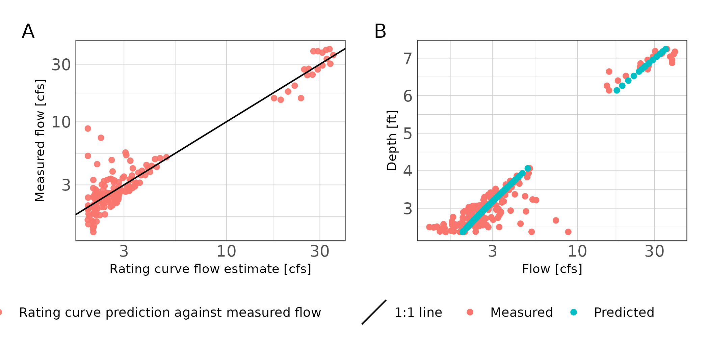

```r
## readr imports data
library(readr)
## tibbles are advanced fancy dataframes
library(tibble)
## dplyr for data handling and piping functions
library(dplyr)
## ggplot for plots
library(ggplot2)
## stringr to read and manipulate strings
library(stringr)
## here is a function to ensure file paths are correct
library(here)
## units and ggforce facilitate attaching units to data
library(units)
library(ggforce)
## hrbrtheme is optional, I use it to pretty my plots
library(hrbrthemes)
## lubridate provides functions for handling time and date
library(lubridate)
## purrr lets us use map_ functions as an alternative to loops
library(purrr)
## hydroGOF provide goodness of fit metrics (NSE, RMSE, etc.)
library(hydroGOF)
## tsibble and imputeTS will allow some simple time series interpolation
library(tsibble)
library(imputeTS)
## gt
library(gtsummary)
## set some options
update_geom_font_defaults(font_rc)
units_options(parse = FALSE)


## some custom functions
theme_ms <- function(...) {
  theme_ipsum_rc(plot_margin = margin(10,10,10,10),
              axis_title_just = "c") +
    theme(legend.position = "bottom",
          panel.background = element_rect(fill = "white", 
            colour = NA), 
          panel.border = element_rect(fill = NA, 
            colour = "grey20"),
          ...)
}

exponent <- function(x, pow) {
  (abs(x)^pow)*sign(x)
}
```

## About

This document walks through some exploratory data analysis to develop rating curves and streamflow predictions on Thompsons Creek. The purpose is to utilize (1) instantaneous streamflows measured during periodic deployments of bottom mounted doppler units and (2) instantaneous depth measurements from water level data loggers deployed long-term in-stream to create and update rating curves. The rating curves will be utilized to calculate streamflow over the HOBO pressure transducer deployment period (approximately 1-yr). The resulting data will be used to create and validate regression and DAR streamflow estimates in Thompsons creek over a 10-15 year period.

## Introduction

Due to the high costs associated with continuous in-stream measurements of stream discharge, it is preferable to estimate discharge using stream height measurements. Continuous measurements of stream height can be accomplished inexpensively using pressure transducers. When supplemented with periodic discharge measurements, a power function can relate stream height and discharge [@venetis1970note]:

\begin{equation}
  Q = K(H-H_0)^z
  (\#eq:powerfunction)
\end{equation} 
where:
$Q$ represents steady state discharge, $H$ represents stream height (stage), $H_0$ is the stage at zero discharge; $K$ and $z$ are rating curve constants.

Unsteady flows occur when the rising and falling stages of a stream hydrograph result in different discharges at identical stream heights. This resulting hysteresis-affected rating curve will present as a loop as opposed to a line. The modified Jones formula described by @petersen-overleir_modelling_2006 and @zakwan_spreadsheet-based_2018 may be used:

\begin{equation}
  Q = K(h-a)^n\times\sqrt{1 + x\frac{\partial h}{\partial t}}
  (\#eq:Jonesformula)
\end{equation} 

where:
$Q$ is discharge, $h$ is stream height, and $\frac{\partial h}{\partial t}}$ is the partial first order derivative approximated using finite differences. This can be considered the slope or instantaneous rate of change for the function between stream height and time which is estimated using measured stream height values. $K$, $a$, $n$, and $x$ are rating curve constants.

A number of different methods are available to solve for the rating curve parameters. We use a quasi-Newton optimization method to minimize the residual sum of square error (SSE) of the rating curve parameters. The residual SSE is calculated as:

\begin{equation}
SSE = \sum\limits_{i=1}^N[X-Y]^2
  (\#eq:sseformula)
\end{equation} 

where:
$X$ is the measured value and $Y$ is the predicted value. Nonlinear optimization methods, such as quasi-Newton optimization, search though parameter combinations to minimize the objective function (residual SSE in this case).

## Method

### Data collection

Water level data loggers (HOBO U20 Series Water Level Data Loggers) were deployed at TCEQ SWQM stations 16396, 16397, and 16882. An additional data logger was deployed at ... to provide ambient atmospheric pressure corrections for the data loggers deployed underwater. Water level data loggers were deployed near continuously from 2020-03-02 through 2021-..-... and setup to record water level at 15-minute intervals.


```r
## make a list of files to import
file_paths <- paste0(here("Data/Hobo"),
                     "/",
                     list.files(path = here("Data/Hobo"),
                                pattern = ".csv"))

## create a blank tibble to fill
hobo_df <- tibble()


## loop through file paths to read each file
for (i in file_paths) {
  x <- read_csv(
    i,
    skip = 2,
    col_names = c(
      "Row",
      "Date",
      "Time",
      "Abs_Pres",
      "Temp",
      "Bar_Pressure",
      "Water_Level",
      "Coupler_Detached",
      "Coupler_Attached",
      "Stopped",
      "EOF"
    ),
    col_types = "nccnnnncccc"
  )
  x$file <- i
  hobo_df <- bind_rows(hobo_df, x)
  rm(x)
}

## clean up the dataframe
hobo_df <- hobo_df %>%
  mutate(
    ## regex extracts site number from file path
    Site = str_extract(file, "\\d{1,6}"),
    
    ## convert date and time columns to date/time format
    dt = paste(Date, Time),
    Date_Time = as.POSIXct(paste(Date, Time),
                           tz = "Etc/GMT-6",
                           format = "%m/%d/%y %I:%M:%S %p")) %>%
  mutate(Site = as.factor(Site)) %>%
  ## select the columns we need to keep
  dplyr::select(Abs_Pres, Temp, Water_Level, Site, Date_Time) %>%
  ## filter rows without water_level
  dplyr::filter(!is.na(Water_Level))
  
## attach units to our columns
units(hobo_df$Water_Level) <- as_units("ft")
units(hobo_df$Temp) <- as_units("°F")
units(hobo_df$Abs_Pres) <- as_units("psi")

## report summary stats
hobo_df %>% 
  select(Site, Water_Level) %>%
  mutate(Water_Level = as.numeric(Water_Level)) %>%
  tbl_summary(by = Site) %>%
  add_n() %>%
  modify_header(label = "**Variable**")
```

```{=html}
<style>html {
  font-family: -apple-system, BlinkMacSystemFont, 'Segoe UI', Roboto, Oxygen, Ubuntu, Cantarell, 'Helvetica Neue', 'Fira Sans', 'Droid Sans', Arial, sans-serif;
}

#wbllvygmcv .gt_table {
  display: table;
  border-collapse: collapse;
  margin-left: auto;
  margin-right: auto;
  color: #333333;
  font-size: 16px;
  font-weight: normal;
  font-style: normal;
  background-color: #FFFFFF;
  width: auto;
  border-top-style: solid;
  border-top-width: 2px;
  border-top-color: #A8A8A8;
  border-right-style: none;
  border-right-width: 2px;
  border-right-color: #D3D3D3;
  border-bottom-style: solid;
  border-bottom-width: 2px;
  border-bottom-color: #A8A8A8;
  border-left-style: none;
  border-left-width: 2px;
  border-left-color: #D3D3D3;
}

#wbllvygmcv .gt_heading {
  background-color: #FFFFFF;
  text-align: center;
  border-bottom-color: #FFFFFF;
  border-left-style: none;
  border-left-width: 1px;
  border-left-color: #D3D3D3;
  border-right-style: none;
  border-right-width: 1px;
  border-right-color: #D3D3D3;
}

#wbllvygmcv .gt_title {
  color: #333333;
  font-size: 125%;
  font-weight: initial;
  padding-top: 4px;
  padding-bottom: 4px;
  border-bottom-color: #FFFFFF;
  border-bottom-width: 0;
}

#wbllvygmcv .gt_subtitle {
  color: #333333;
  font-size: 85%;
  font-weight: initial;
  padding-top: 0;
  padding-bottom: 4px;
  border-top-color: #FFFFFF;
  border-top-width: 0;
}

#wbllvygmcv .gt_bottom_border {
  border-bottom-style: solid;
  border-bottom-width: 2px;
  border-bottom-color: #D3D3D3;
}

#wbllvygmcv .gt_col_headings {
  border-top-style: solid;
  border-top-width: 2px;
  border-top-color: #D3D3D3;
  border-bottom-style: solid;
  border-bottom-width: 2px;
  border-bottom-color: #D3D3D3;
  border-left-style: none;
  border-left-width: 1px;
  border-left-color: #D3D3D3;
  border-right-style: none;
  border-right-width: 1px;
  border-right-color: #D3D3D3;
}

#wbllvygmcv .gt_col_heading {
  color: #333333;
  background-color: #FFFFFF;
  font-size: 100%;
  font-weight: normal;
  text-transform: inherit;
  border-left-style: none;
  border-left-width: 1px;
  border-left-color: #D3D3D3;
  border-right-style: none;
  border-right-width: 1px;
  border-right-color: #D3D3D3;
  vertical-align: bottom;
  padding-top: 5px;
  padding-bottom: 6px;
  padding-left: 5px;
  padding-right: 5px;
  overflow-x: hidden;
}

#wbllvygmcv .gt_column_spanner_outer {
  color: #333333;
  background-color: #FFFFFF;
  font-size: 100%;
  font-weight: normal;
  text-transform: inherit;
  padding-top: 0;
  padding-bottom: 0;
  padding-left: 4px;
  padding-right: 4px;
}

#wbllvygmcv .gt_column_spanner_outer:first-child {
  padding-left: 0;
}

#wbllvygmcv .gt_column_spanner_outer:last-child {
  padding-right: 0;
}

#wbllvygmcv .gt_column_spanner {
  border-bottom-style: solid;
  border-bottom-width: 2px;
  border-bottom-color: #D3D3D3;
  vertical-align: bottom;
  padding-top: 5px;
  padding-bottom: 6px;
  overflow-x: hidden;
  display: inline-block;
  width: 100%;
}

#wbllvygmcv .gt_group_heading {
  padding: 8px;
  color: #333333;
  background-color: #FFFFFF;
  font-size: 100%;
  font-weight: initial;
  text-transform: inherit;
  border-top-style: solid;
  border-top-width: 2px;
  border-top-color: #D3D3D3;
  border-bottom-style: solid;
  border-bottom-width: 2px;
  border-bottom-color: #D3D3D3;
  border-left-style: none;
  border-left-width: 1px;
  border-left-color: #D3D3D3;
  border-right-style: none;
  border-right-width: 1px;
  border-right-color: #D3D3D3;
  vertical-align: middle;
}

#wbllvygmcv .gt_empty_group_heading {
  padding: 0.5px;
  color: #333333;
  background-color: #FFFFFF;
  font-size: 100%;
  font-weight: initial;
  border-top-style: solid;
  border-top-width: 2px;
  border-top-color: #D3D3D3;
  border-bottom-style: solid;
  border-bottom-width: 2px;
  border-bottom-color: #D3D3D3;
  vertical-align: middle;
}

#wbllvygmcv .gt_from_md > :first-child {
  margin-top: 0;
}

#wbllvygmcv .gt_from_md > :last-child {
  margin-bottom: 0;
}

#wbllvygmcv .gt_row {
  padding-top: 8px;
  padding-bottom: 8px;
  padding-left: 5px;
  padding-right: 5px;
  margin: 10px;
  border-top-style: solid;
  border-top-width: 1px;
  border-top-color: #D3D3D3;
  border-left-style: none;
  border-left-width: 1px;
  border-left-color: #D3D3D3;
  border-right-style: none;
  border-right-width: 1px;
  border-right-color: #D3D3D3;
  vertical-align: middle;
  overflow-x: hidden;
}

#wbllvygmcv .gt_stub {
  color: #333333;
  background-color: #FFFFFF;
  font-size: 100%;
  font-weight: initial;
  text-transform: inherit;
  border-right-style: solid;
  border-right-width: 2px;
  border-right-color: #D3D3D3;
  padding-left: 12px;
}

#wbllvygmcv .gt_summary_row {
  color: #333333;
  background-color: #FFFFFF;
  text-transform: inherit;
  padding-top: 8px;
  padding-bottom: 8px;
  padding-left: 5px;
  padding-right: 5px;
}

#wbllvygmcv .gt_first_summary_row {
  padding-top: 8px;
  padding-bottom: 8px;
  padding-left: 5px;
  padding-right: 5px;
  border-top-style: solid;
  border-top-width: 2px;
  border-top-color: #D3D3D3;
}

#wbllvygmcv .gt_grand_summary_row {
  color: #333333;
  background-color: #FFFFFF;
  text-transform: inherit;
  padding-top: 8px;
  padding-bottom: 8px;
  padding-left: 5px;
  padding-right: 5px;
}

#wbllvygmcv .gt_first_grand_summary_row {
  padding-top: 8px;
  padding-bottom: 8px;
  padding-left: 5px;
  padding-right: 5px;
  border-top-style: double;
  border-top-width: 6px;
  border-top-color: #D3D3D3;
}

#wbllvygmcv .gt_striped {
  background-color: rgba(128, 128, 128, 0.05);
}

#wbllvygmcv .gt_table_body {
  border-top-style: solid;
  border-top-width: 2px;
  border-top-color: #D3D3D3;
  border-bottom-style: solid;
  border-bottom-width: 2px;
  border-bottom-color: #D3D3D3;
}

#wbllvygmcv .gt_footnotes {
  color: #333333;
  background-color: #FFFFFF;
  border-bottom-style: none;
  border-bottom-width: 2px;
  border-bottom-color: #D3D3D3;
  border-left-style: none;
  border-left-width: 2px;
  border-left-color: #D3D3D3;
  border-right-style: none;
  border-right-width: 2px;
  border-right-color: #D3D3D3;
}

#wbllvygmcv .gt_footnote {
  margin: 0px;
  font-size: 90%;
  padding: 4px;
}

#wbllvygmcv .gt_sourcenotes {
  color: #333333;
  background-color: #FFFFFF;
  border-bottom-style: none;
  border-bottom-width: 2px;
  border-bottom-color: #D3D3D3;
  border-left-style: none;
  border-left-width: 2px;
  border-left-color: #D3D3D3;
  border-right-style: none;
  border-right-width: 2px;
  border-right-color: #D3D3D3;
}

#wbllvygmcv .gt_sourcenote {
  font-size: 90%;
  padding: 4px;
}

#wbllvygmcv .gt_left {
  text-align: left;
}

#wbllvygmcv .gt_center {
  text-align: center;
}

#wbllvygmcv .gt_right {
  text-align: right;
  font-variant-numeric: tabular-nums;
}

#wbllvygmcv .gt_font_normal {
  font-weight: normal;
}

#wbllvygmcv .gt_font_bold {
  font-weight: bold;
}

#wbllvygmcv .gt_font_italic {
  font-style: italic;
}

#wbllvygmcv .gt_super {
  font-size: 65%;
}

#wbllvygmcv .gt_footnote_marks {
  font-style: italic;
  font-size: 65%;
}
</style>
<div id="wbllvygmcv" style="overflow-x:auto;overflow-y:auto;width:auto;height:auto;"><table class="gt_table">
  
  <thead class="gt_col_headings">
    <tr>
      <th class="gt_col_heading gt_columns_bottom_border gt_left" rowspan="1" colspan="1"><strong>Variable</strong></th>
      <th class="gt_col_heading gt_columns_bottom_border gt_center" rowspan="1" colspan="1"><strong>N</strong></th>
      <th class="gt_col_heading gt_columns_bottom_border gt_center" rowspan="1" colspan="1"><strong>16396</strong>, N = 29,821<sup class="gt_footnote_marks">1</sup></th>
      <th class="gt_col_heading gt_columns_bottom_border gt_center" rowspan="1" colspan="1"><strong>16397</strong>, N = 29,823<sup class="gt_footnote_marks">1</sup></th>
      <th class="gt_col_heading gt_columns_bottom_border gt_center" rowspan="1" colspan="1"><strong>16882</strong>, N = 30,505<sup class="gt_footnote_marks">1</sup></th>
    </tr>
  </thead>
  <tbody class="gt_table_body">
    <tr>
      <td class="gt_row gt_left">Water_Level</td>
      <td class="gt_row gt_center">90,149</td>
      <td class="gt_row gt_center">1.72 (1.66, 1.82)</td>
      <td class="gt_row gt_center">1.42 (1.06, 1.79)</td>
      <td class="gt_row gt_center">2.39 (2.35, 2.44)</td>
    </tr>
  </tbody>
  
  <tfoot>
    <tr class="gt_footnotes">
      <td colspan="5">
        <p class="gt_footnote">
          <sup class="gt_footnote_marks">
            <em>1</em>
          </sup>
           
          Median (IQR)
          <br />
        </p>
      </td>
    </tr>
  </tfoot>
</table></div>
```

Periodic streamflow measurements were made at each SWQM site using a bottom-mounted multi-beam Doppler flow meter (Son-Tek IQ Plus). The Son-Tek IQ Plus measures cross sectional area, stream height, and velocity. Using these measurements, the device utilizes an index velocity method to report instantaneous discharge. The streamflow measurement device were deployed for a few days at a time to capture the full hydrograph under varying flow conditions at each SWQM station. Only one streamflow device was available, so deployments rotated between stations. Streamflow was recorded at 15-minute intervals. 


```r
## make a list of files to import
file_paths <- paste0(here("Data/IQPlus"),
                     "/",
                     list.files(path = here("Data/IQPlus"),
                                pattern = ".csv"))

## create a blank tibble to fill
iqplus_df <- tibble()

## loop through file paths to read each file
for (i in file_paths) {
  x <- read_csv(
    i,
    col_types = "nc______n__n______________________nn______n_________"
  )
  x$file <- i
  iqplus_df <- bind_rows(iqplus_df, x)
  rm(x)
}


iqplus_df <- iqplus_df %>%
    mutate(
    ## regex extracts site number from file path
    Site = str_extract(file, "\\d{1,6}")) %>%
  ## use `dplyr::` to specify which rename function to use, just in case
  dplyr::rename(Sample_Number =`Sample number`,
                Date_Time = `Sample time`,
                Depth = `Depth (ft)`,
                Flow = `Flow (ft³/s)`,
                System_In_Water = `System in water (%)`,
                System_Status = `System status (status codes)`,
                Index_Velocity = `Velocity (mean) (ft/s)`) %>%
  dplyr::select(-c(Sample_Number, file)) %>%
  mutate(Date_Time = as.POSIXct(Date_Time,
                                tz = "Etc/GMT-6",
                                format = "%Y-%m-%d %H:%M:%S"))


## attach units to our columns
units(iqplus_df$Depth) <- as_units("ft")
units(iqplus_df$Flow) <- as_units("ft^3/s")
units(iqplus_df$Index_Velocity) <- as_units("ft/s")

## some data cleaning
iqplus_df %>%
  filter(System_Status == 0,
         System_In_Water == 100,
         as.numeric(Depth) >= 0.26, ## minimum operating depth
         as.numeric(Flow) > 0) -> iqplus_df

ggplot(iqplus_df) +
  geom_point(aes(Date_Time, Flow)) +
  facet_wrap(~Site, ncol = 1, scales = "free_y") +
  theme_ms()
```


```r
## In order to join the hobo measured depth to the IQ streamflow measurements
## we need to interpolate measured Depth to every minute because the depths are
## offset. Then we can join the data. we will use linear interpolation.

## I need a pipe friendly function that assigns an attribute to 
## a tibble (tsibble) and returns a tibble (tsibble)
pipe_attr <- function(df) {
  attr(df, "interval") <- new_interval(minute = 1)
  return(df)
}

## use purrr::map to run interpolation on each site
hobo_df %>%
  split(.$Site) %>%
  map(~dplyr::mutate(.x, Date_Time = round_date(.x$Date_Time, unit = "minute"))) %>%
  map(~as_tsibble(.x, key = Site, index = Date_Time)) %>%
  map(~pipe_attr(.x)) %>%
  map(~fill_gaps(.x)) %>%
  map(~mutate(.x, Water_Level = na_interpolation(as.numeric(Water_Level), option = "linear"))) %>%
  bind_rows() %>%
  as_tibble() %>%
  select(Water_Level, Site, Date_Time) -> hobo_df_interpolated

## replace Depth in iqplus_df with Water_Level reading from Hobo
## this is the dataframe we will develop rating curves from.
iqplus_df %>%
  left_join(hobo_df_interpolated, by = c("Site" = "Site", "Date_Time" = "Date_Time")) %>%
  select(Date_Time, Flow, System_In_Water, System_Status, Site, Water_Level) %>%
  rename(Depth = Water_Level) %>%
  mutate(Depth = set_units(Depth, "ft")) -> iqplus_df
```


### Rating curve development

In-stream and stream bank conditions change through the year due to plant growth, plant dieback, sedimentation, erosion, and other processes. These changing conditions can necessitate the development of multiple rating curves. Exploratory data analysis was used to identify periods of change and the potential for hysteresis affected rating curves. Once rating curve periods and appropriate formulas were determined, rating curve parameters were estimated using the `optim` function in `R` by minimizing the residual SSE.

Individual rating curves were used to estimate streamflows using the measured stream heights. Nash-Sutcliffe Efficiency (NSE) and normalized Root Mean Square Error was used to evaluate goodness-of-fit between measured and estimated streamflow. NSE is a normalized statistic that evaluates the relative residual variance against the measured data variance and is calculated as:

\begin{equation}
NSE = 1 - \frac{\sum\limits_{t=1}^T(Q^t_{sim}-Q^t_{obs})^2}{\sum\limits_{t=1}^T(Q^t_{obs}-\bar{Q}_{obs})^2}
  (\#eq:nseformula)
\end{equation} 

Where:
***add***

***Add nRMSE formula***


## Results

### Site 16396

Based on exploratory analysis, two rating curves were developed for site 16396. The rating curve periods were 2020-03-03 through 2020-11-30 and 2020-12-01 through 2021-01-31. Due to apparent unsteady flow in the observed hydrogaphs, we applied the Jones formula (Formaula\@ref(eq:Jonesformula)). Both time periods resulted in a rating curve with NSE greater than 0.97 and nRMSE less than 2% indicating excellent fit (Table \@ref(tab:results16369); Figure \@ref(fig:metricplot16396)).


```r
## Make dataframe for site 16396 before december 

iqplus_df %>%
  filter(Site == "16396",
         System_Status == 0,
         System_In_Water == 100,
         as.numeric(Depth) >= 0.26, ## minimum operating depth
         as.numeric(Flow) >= 0,
         Date_Time < as.Date("2020-12-01")) %>%
  arrange(Date_Time) %>%
  mutate(time_lag = lag(Date_Time, default = Date_Time[1]),
         diff_time = as.numeric(difftime(Date_Time, time_lag, units = "hours"))) %>%
  group_split(cumsum(diff_time > 8)) %>%
  ## remove events where max flow did not go over 10 cfs
  keep(~ max(as.numeric(.x$Flow)) > 10) %>%
  map(~select(.x, Date_Time, Depth, Flow)) %>%
  map(~mutate(.x,
              time_lag = lag(Date_Time, default = Date_Time[1]),
              diff_time = as.numeric(difftime(Date_Time, time_lag, units = "hours")),
              diff_depth = c(0, diff(.x$Depth)))) %>%
  imap(~mutate(.x, event = as.character(.y))) %>%
  bind_rows() %>%
  filter(!is.na(diff_depth)) %>%
  mutate(J = as.numeric(diff_depth)/as.numeric(diff_time)) -> df_16396_2020_12

iqplus_df %>%
  filter(Site == "16396",
         System_Status == 0,
         System_In_Water == 100,
         as.numeric(Depth) >= 0.26, ## minimum operating depth
         as.numeric(Flow) >= 0,
         Date_Time >= as.Date("2020-12-01") &
           Date_Time <= as.Date("2021-02-01")) %>%
  arrange(Date_Time) %>%
  mutate(time_lag = lag(Date_Time, default = Date_Time[1]),
         diff_time = as.numeric(difftime(Date_Time, time_lag, units = "hours"))) %>%
  group_split(cumsum(diff_time > 8)) %>%
  ## remove events where max flow did not go over 10 cfs
  keep(~ max(as.numeric(.x$Flow)) > 10) %>%
  map(~select(.x, Date_Time, Depth, Flow)) %>%
  map(~mutate(.x,
              time_lag = lag(Date_Time, default = Date_Time[1]),
              diff_time = as.numeric(difftime(Date_Time, time_lag, units = "hours")),
              diff_depth = c(0, diff(.x$Depth)))) %>%
  imap(~mutate(.x, event = as.character(.y))) %>%
  bind_rows() %>%
  filter(!is.na(diff_depth)) %>%
  mutate(J = as.numeric(diff_depth)/as.numeric(diff_time)) -> df_16396_2021_02
```


```r
SSE <- function(pars, data) {
  Depth = as.numeric(data$Depth)
  J = data$J
  K = pars[1]
  a = pars[2]
  n = pars[3]
  x = pars[4]

  
  preds <- (K*exponent(x = Depth - a, pow = n)) * exponent(x = (1 + x * J), pow = (1/2))
  #print(preds)
  Q = as.numeric(data$Flow)
  
  ## minimize the sum of square errors per the paper
  sse <- sum((Q - preds)^2, na.rm = TRUE)
  #print(sse)
  sse
}

par <- c(K = 30,
         a = 1,
         n = 2,
         x = 1)

## limits to the parameter space
lower <- c(-10, 0.1, -10, 0.0001)
upper <- c(200, 10, 10, 10)

optim_par_16396_2020_12 <- optim(par = par,
                   fn = SSE,
                   data = df_16396_2020_12,
                   lower = lower,
                   upper = upper,
                   method = "L-BFGS-B")

optim_par_16396_2021_02 <- optim(par = par,
                   fn = SSE,
                   data = df_16396_2021_02,
                   lower = lower,
                   upper = upper,
                   method = "L-BFGS-B")
```


```r
## setup dataframe with parameter results. Will use this later to report parameters and GOF metrics
df_results_16369 <- tibble(Site = c("16396","16396"),
                           Period = c("2020-03-01 : 2020-11-30",
                                      "2020-12-01 : 2021-01-31"),
                           K = c(optim_par_16396_2020_12$par[[1]],
                                 optim_par_16396_2021_02$par[[1]]),
                           a = c(optim_par_16396_2020_12$par[[2]],
                                 optim_par_16396_2021_02$par[[2]]),
                           n = c(optim_par_16396_2020_12$par[[3]],
                                 optim_par_16396_2021_02$par[[3]]),
                           x = c(optim_par_16396_2020_12$par[[4]],
                                 optim_par_16396_2021_02$par[[4]]))
```


```r
## Develop rating curve predictions and
## create table with GOF metrics
df_16396_2020_12 %>%
    mutate(predicted = (df_results_16369$K[1]*exponent(x = as.numeric(Depth) - df_results_16369$a[1], pow = df_results_16369$n[1])) * exponent(x = (1 + df_results_16369$x[1] * J), pow = (1/2))) -> df_16396_2020_12

df_16396_2021_02 %>%
      mutate(predicted = (df_results_16369$K[2]*exponent(x = as.numeric(Depth) - df_results_16369$a[2], pow = df_results_16369$n[2])) * exponent(x = (1 + df_results_16369$x[2] * J), pow = (1/2))) -> df_16396_2021_02


df_results_16369 %>%
  mutate(NSE = c(
    hydroGOF::NSE(df_16396_2020_12$predicted, as.numeric(df_16396_2020_12$Flow)),
    hydroGOF::NSE(df_16396_2021_02$predicted, as.numeric(df_16396_2021_02$Flow))),
    nRMSE = c(hydroGOF::nrmse(df_16396_2020_12$predicted, as.numeric(df_16396_2020_12$Flow), norm = "maxmin"),
              hydroGOF::nrmse(df_16396_2021_02$predicted, as.numeric(df_16396_2021_02$Flow), norm = "maxmin"))
    ) -> df_results_16369

##display table
kable(df_results_16369, 
      caption = "Rating curve parameter estimates and goodness-of-fit metrics for station 16369.") 
```


Table: (\#tab:results16369)Rating curve parameter estimates and goodness-of-fit metrics for station 16369.

|Site  |Period                  |        K|        a|        n|         x|       NSE| nRMSE|
|:-----|:-----------------------|--------:|--------:|--------:|---------:|---------:|-----:|
|16396 |2020-03-01 : 2020-11-30 | 24.15103| 1.275218| 1.639702| 0.0001000| 0.9802261|     1|
|16396 |2020-12-01 : 2021-01-31 | 26.47283| 1.226563| 1.722387| 0.5904576| 0.9778216|     2|


```r
## plot rating curve results
df_16396_2020_12 %>%
  bind_rows(df_16396_2021_02) %>%
  mutate(predicted = set_units(predicted, "ft^3/s")) %>%
  ggplot() +
  geom_point(aes(as.numeric(predicted), as.numeric(Flow), color = "Rating curve prediction against measured flow"), alpha = 0.25) +
  geom_abline(aes(slope = 1, intercept = 0, linetype = "1:1 line")) +
  scale_x_continuous(name = "Rating curve flow estimate [cfs]", trans = "log10") +
  scale_y_continuous(name = "Measured flow [cfs]", trans = "log10") +
  theme_ms() +
  theme(legend.title = element_blank())
```

```
## Warning: Removed 8 rows containing missing values (geom_point).
```

<div class="figure">

<p class="caption">(\#fig:metricplot16396)Scatter plot of rating curve estimated flows against measured flows at station 16396</p>
</div>

*** add plot of full predicted flows over time using hobo data ***


## Site 16397

Exploratory analysis indicated pooled conditions when during doppler flow meter deployment from August 2020 through November 2020. A single rating curve was developed at this site using the power function (Formula \@ref(eq:powerfunction)) since unsteady flow conditions were not observed in the hydrographs. Rating curve predictions resulted in NSE greater than 0.95 indicating excellent fit (Table \@ref(tab:results16369)). The nRMSE was less than 6%, which is likely a good result for the smaller sample sized obtained at this station and probably influenced by the observed low flow variance (Table \@ref(tab:results16369); Figure \@ref(fig:metricplot16396)).


*** add plot of full predicted flows over time using hobo data ***


```r
## setup dataframe to fit rating curve to 16397

iqplus_df %>%
  filter(Site == "16397",
         System_Status == 0,
         System_In_Water == 100,
         as.numeric(Depth) >= 0.26, ## minimum operating depth
         as.numeric(Flow) > 0) %>%
  filter(Date_Time >= as.POSIXct("2020-12-15") & 
           Date_Time >= as.POSIXct("2020-12-31") &
           as.numeric(Depth) > 1.5 |
           Date_Time >= as.POSIXct("2020-01-05") &
           as.numeric(Depth) > 2) %>%
  # filter(as.numeric(Depth) < 2 & as.numeric(Flow) < 4.3 | # low flow outliers filtered based on boxplots
  #          as.numeric(Depth) >= 2) %>%
  arrange(Date_Time) %>%
  mutate(time_lag = lag(Date_Time, default = Date_Time[1]),
         diff_time = as.numeric(difftime(Date_Time, time_lag, units = "hours"))) %>%
  group_split(cumsum(diff_time > 8)) %>%
  ## remove events where max flow did not go over 10 cfs
  ## keep(~ max(as.numeric(.x$Flow)) > 10) %>%
  map(~select(.x, Date_Time, Depth, Flow)) %>%
  map(~mutate(.x,
              time_lag = lag(Date_Time, default = Date_Time[1]),
              diff_time = as.numeric(difftime(Date_Time, time_lag, units = "hours")),
              diff_depth = c(0, diff(.x$Depth)))) %>%
  imap(~mutate(.x, event = as.character(.y))) %>%
  bind_rows() %>%
  filter(!is.na(diff_depth)) %>%
  mutate(J = as.numeric(diff_depth)/as.numeric(diff_time)) -> df_16397


SSE <- function(pars, data) {
  Depth = as.numeric(data$Depth)
  K = pars[1]
  H_0 = pars[2]
  Z = pars[3]


  preds <- K*(as.numeric(Depth) - H_0)^Z
  #print(preds)
  Q = as.numeric(data$Flow)

  ## minimize the sum of square errors per the paper
  sse <- sum((Q - preds)^2, na.rm = TRUE)
  #print(sse)
  sse
}

par <- c(K = 1,
         H_0 = .001,
         Z = 2)

## limits to the parameter space
lower <- c(-Inf, -5, 0.001)
upper <- c(Inf, 5, Inf)

optim_par_16397 <- optim(par = par,
                   fn = SSE,
                   data = df_16397,
                   lower = lower,
                   upper = upper,
                   method = "L-BFGS-B")
```


```r
## setup dataframe with parameter results. Will use this later to report parameters and GOF metrics
df_results_16397 <- tibble(Site = c("16397"),
                           Period = c("2020-03-01 : 2020-01-30"),
                           K = c(optim_par_16397$par[[1]]),
                           H_0 = c(optim_par_16397$par[[2]]),
                           Z = c(optim_par_16397$par[[3]]))
```


```r
df_16397 %>%
  mutate(predicted = df_results_16397$K[1]*(as.numeric(Depth) - df_results_16397$H_0[1])^df_results_16397$Z[1]) -> df_16397


df_results_16397 %>%
  mutate(NSE = hydroGOF::NSE(df_16397$predicted, as.numeric(df_16397$Flow)),
         nRMSE = hydroGOF::nrmse(df_16397$predicted, as.numeric(df_16397$Flow),
                              norm="maxmin")) -> df_results_16397

kable(df_results_16397,
      caption = "Rating curve parameter estimates and goodness-of-fit metrics for station 16397.")
```


Table: (\#tab:results16397)Rating curve parameter estimates and goodness-of-fit metrics for station 16397.

|Site  |Period                  |         K|       H_0|       Z|       NSE| nRMSE|
|:-----|:-----------------------|---------:|---------:|-------:|---------:|-----:|
|16397 |2020-03-01 : 2020-01-30 | 0.0007257| -3.756137| 4.47589| 0.8471358|   4.7|


```r
## plot rating curve results
df_16397 %>%
  mutate(predicted = set_units(predicted, "ft^3/s")) %>%
  ggplot() +
  geom_point(aes(as.numeric(predicted), as.numeric(Flow), color = "Rating curve prediction against measured flow"), alpha = 0.9) +
  geom_abline(aes(slope = 1, intercept = 0, linetype = "1:1 line")) +
  scale_x_continuous(name = "Rating curve flow estimate [cfs]", trans = "log10") +
  scale_y_continuous(name = "Measured flow [cfs]", trans = "log10") +
  theme_ms() +
  theme(legend.title = element_blank())
```

<div class="figure">

<p class="caption">(\#fig:metricplot16397)Scatter plot of rating curve estimated flows against measured flows at station 16397</p>
</div>

### Site 16882

Based on exploratory analysis, three rating curves were developed for site 16396. The rating curve periods were 2020-03-03 through 2020-05-30; 2020-06-01 through 2020-10-31; and 2020-11-01 through 2021-01-31. Due to apparent unsteady flow in the observed hydrogaphs, we applied the Jones formula (Formula\@ref(eq:Jonesformula)).


```r
## make 3 different dataframes to fit jones formula to.

iqplus_df %>%
  filter(Site == "16882",
         System_Status == 0,
         System_In_Water == 100,
         as.numeric(Depth) >= 0.26, ## minimum operating depth
         as.numeric(Flow) > 0) %>%
    filter(Date_Time > as.POSIXct("2020-05-01") &
           Date_Time < as.POSIXct("2020-06-01")) %>%
  ## remove outliers identified in box plots under 1 foot depth
  filter(as.numeric(Depth) < 1 & as.numeric(Flow) < 4.3 |
           as.numeric(Depth) > 1) %>%
  arrange(Date_Time) %>%
  mutate(time_lag = lag(Date_Time, default = Date_Time[1]),
         diff_time = as.numeric(difftime(Date_Time, time_lag, units = "hours"))) %>%
  group_split(cumsum(diff_time > 8)) %>%
  ## remove events where max flow did not go over 10 cfs
  keep(~ max(as.numeric(.x$Flow)) > 10) %>%
  map(~select(.x, Date_Time, Depth, Flow)) %>%
  map(~mutate(.x,
              time_lag = lag(Date_Time, default = Date_Time[1]),
              diff_time = as.numeric(difftime(Date_Time, time_lag, units = "hours")),
              diff_depth = c(0, diff(.x$Depth)))) %>%
  imap(~mutate(.x, event = as.character(.y))) %>%
  bind_rows() %>%
  filter(!is.na(diff_depth)) %>%
  mutate(J = as.numeric(diff_depth)/as.numeric(diff_time)) -> df_16882_2020_03

iqplus_df %>%
  filter(Site == "16882",
         System_Status == 0,
         System_In_Water == 100,
         as.numeric(Depth) >= 0.26, ## minimum operating depth
         as.numeric(Flow) > 0) %>%
    filter(Date_Time >= as.POSIXct("2020-06-01") &
           Date_Time < as.POSIXct("2020-10-31")) %>%
  ## remove outliers identified in box plots under 1 foot depth
  filter(as.numeric(Depth) < 1 & as.numeric(Flow) < 4.3 |
           as.numeric(Depth) > 1) %>%
  arrange(Date_Time) %>%
  mutate(time_lag = lag(Date_Time, default = Date_Time[1]),
         diff_time = as.numeric(difftime(Date_Time, time_lag, units = "hours"))) %>%
  group_split(cumsum(diff_time > 8)) %>%
  ## remove events where max flow did not go over 10 cfs
  keep(~ max(as.numeric(.x$Flow)) > 10) %>%
  map(~select(.x, Date_Time, Depth, Flow)) %>%
  map(~mutate(.x,
              time_lag = lag(Date_Time, default = Date_Time[1]),
              diff_time = as.numeric(difftime(Date_Time, time_lag, units = "hours")),
              diff_depth = c(0, diff(.x$Depth)))) %>%
  imap(~mutate(.x, event = as.character(.y))) %>%
  bind_rows() %>%
  filter(!is.na(diff_depth)) %>%
  mutate(J = as.numeric(diff_depth)/as.numeric(diff_time)) -> df_16882_2020_06


iqplus_df %>%
  filter(Site == "16882",
         System_Status == 0,
         System_In_Water == 100,
         as.numeric(Depth) >= 0.26, ## minimum operating depth
         as.numeric(Flow) > 0) %>%
    filter(Date_Time >= as.POSIXct("2020-11-01") &
           Date_Time < as.POSIXct("2021-01-31")) %>%
  ## remove outliers identified in box plots under 1 foot depth
  filter(as.numeric(Depth) < 1 & as.numeric(Flow) < 4.3 |
           as.numeric(Depth) > 1) %>%
  arrange(Date_Time) %>%
  mutate(time_lag = lag(Date_Time, default = Date_Time[1]),
         diff_time = as.numeric(difftime(Date_Time, time_lag, units = "hours"))) %>%
  group_split(cumsum(diff_time > 8)) %>%
  ## remove events where max flow did not go over 10 cfs
  keep(~ max(as.numeric(.x$Flow)) > 10) %>%
  map(~select(.x, Date_Time, Depth, Flow)) %>%
  map(~mutate(.x,
              time_lag = lag(Date_Time, default = Date_Time[1]),
              diff_time = as.numeric(difftime(Date_Time, time_lag, units = "hours")),
              diff_depth = c(0, diff(.x$Depth)))) %>%
  imap(~mutate(.x, event = as.character(.y))) %>%
  bind_rows() %>%
  filter(!is.na(diff_depth)) %>%
  mutate(J = as.numeric(diff_depth)/as.numeric(diff_time)) -> df_16882_2020_11
```


```r
## estimate parameters for each dataset
SSE <- function(pars, data) {
  Depth = as.numeric(data$Depth)
  J = data$J
  K = pars[1]
  a = pars[2]
  n = pars[3]
  x = pars[4]

  
  preds <- (K*exponent(x = Depth - a, pow = n)) * exponent(x = (1 + x * J), pow = (1/2))
  #print(preds)
  Q = as.numeric(data$Flow)
  
  ## minimize the sum of square errors per the paper
  sse <- sum((Q - preds)^2, na.rm = TRUE)
  #print(sse)
  sse
}

par <- c(K = 30,
         a = 1,
         n = 2,
         x = 1)

## limits to the parameter space
lower <- c(-30, 0.1, -20, -10)
upper <- c(200, 10, 10, 10)

optim_par_16882_2020_03 <- optim(par = par,
                   fn = SSE,
                   data = df_16882_2020_03,
                   lower = lower,
                   upper = upper,
                   method = "L-BFGS-B")

## starting estimates need some tweaking for the third season
par <- c(K = 5,
         a = 5,
         n = 2,
         x = 1)

## limits to the parameter space
lower <- c(0.1, 0.00001, 0.00001, -10)
upper <- c(200, 10, 10, 10)

optim_par_16882_2020_06 <- optim(par = par,
                   fn = SSE,
                   data = df_16882_2020_06,
                   lower = lower,
                   upper = upper,
                   method = "L-BFGS-B")

## starting estimates need some tweaking for the third season
par <- c(K = 8,
         a = 1,
         n = 2,
         x = 1)

## limits to the parameter space
lower <- c(0.1, 0.00001, 0.00001, -10)
upper <- c(200, 10, 10, 10)

optim_par_16882_2020_11 <- optim(par = par,
                   fn = SSE,
                   data = df_16882_2020_11,
                   lower = lower,
                   upper = upper,
                   method = "L-BFGS-B")
```


```r
## setup dataframe with parameter results. Will use this later to report parameters and GOF metrics
df_results_16882 <- tibble(Site = c("16882","16882","16882"),
                           Period = c("2020-03-01 : 2020-05-31",
                                      "2020-06-01 : 2020-10-31",
                                      "2020-11-01 : 2021-01-31"),
                           K = c(optim_par_16882_2020_03$par[[1]],
                                 optim_par_16882_2020_06$par[[1]],
                                 optim_par_16882_2020_11$par[[1]]),
                           a = c(optim_par_16882_2020_03$par[[2]],
                                 optim_par_16882_2020_06$par[[2]],
                                 optim_par_16882_2020_11$par[[2]]),
                           n = c(optim_par_16882_2020_03$par[[3]],
                                 optim_par_16882_2020_06$par[[3]],
                                 optim_par_16882_2020_11$par[[3]]),
                           x = c(optim_par_16882_2020_03$par[[4]],
                                 optim_par_16882_2020_06$par[[4]],
                                 optim_par_16882_2020_11$par[[4]]))

## Develop rating curve predictions and
## create table with GOF metrics
df_16882_2020_03 %>%
    mutate(predicted = (df_results_16882$K[1]*exponent(x = as.numeric(Depth) - df_results_16882$a[1], pow = df_results_16882$n[1])) * exponent(x = (1 + df_results_16882$x[1] * J), pow = (1/2))) -> df_16882_2020_03

df_16882_2020_06 %>%
    mutate(predicted = (df_results_16882$K[2]*exponent(x = as.numeric(Depth) - df_results_16882$a[2], pow = df_results_16882$n[2])) * exponent(x = (1 + df_results_16882$x[2] * J), pow = (1/2))) -> df_16882_2020_06

df_16882_2020_11 %>%
    mutate(predicted = (df_results_16882$K[3]*exponent(x = as.numeric(Depth) - df_results_16882$a[3], pow = df_results_16882$n[3])) * exponent(x = (1 + df_results_16882$x[3] * J), pow = (1/2))) -> df_16882_2020_11


df_results_16882 %>%
  mutate(NSE = c(
    hydroGOF::NSE(df_16882_2020_03$predicted, as.numeric(df_16882_2020_03$Flow)),
    hydroGOF::NSE(df_16882_2020_06$predicted, as.numeric(df_16882_2020_06$Flow)),
    hydroGOF::NSE(df_16882_2020_11$predicted, as.numeric(df_16882_2020_11$Flow))),
    nRMSE = c(hydroGOF::nrmse(df_16882_2020_03$predicted, as.numeric(df_16882_2020_03$Flow), norm = "maxmin"),
              hydroGOF::nrmse(df_16882_2020_06$predicted, as.numeric(df_16882_2020_06$Flow), norm = "maxmin"),
              hydroGOF::nrmse(df_16882_2020_11$predicted, as.numeric(df_16882_2020_11$Flow), norm = "maxmin"))
    ) -> df_results_16882

##display table
kable(df_results_16882, 
      caption = "Rating curve parameter estimates and goodness-of-fit metrics for station 16882.") 
```


Table: (\#tab:results16882)Rating curve parameter estimates and goodness-of-fit metrics for station 16882.

|Site  |Period                  |          K|        a|          n|           x|        NSE| nRMSE|
|:-----|:-----------------------|----------:|--------:|----------:|-----------:|----------:|-----:|
|16882 |2020-03-01 : 2020-05-31 | -30.000000| 10.00000| -20.000000| -10.0000000| -0.7363925|  33.4|
|16882 |2020-06-01 : 2020-10-31 |   6.939952|  1.66193|   1.374969|  -0.6751434|  0.0430754|   4.3|
|16882 |2020-11-01 : 2021-01-31 |   0.100000|  5.40777|   0.000010| -10.0000000| -0.8549177|   4.3|


```r
## plot rating curve results
df_16882_2020_03 %>%
  bind_rows(df_16882_2020_06, df_16882_2020_11) %>%
  mutate(predicted = set_units(predicted, "ft^3/s")) %>%
  ggplot() +
  geom_point(aes(as.numeric(predicted), as.numeric(Flow), color = "Rating curve prediction against measured flow"), alpha = 0.25) +
  geom_abline(aes(slope = 1, intercept = 0, linetype = "1:1 line")) +
  scale_x_continuous(name = "Rating curve flow estimate [cfs]", trans = "log10") +
  scale_y_continuous(name = "Measured flow [cfs]", trans = "log10") +
  theme_ms() +
  theme(legend.title = element_blank())
```

```
## Warning in self$trans$transform(x): NaNs produced
```

```
## Warning: Transformation introduced infinite values in continuous x-axis
```

```
## Warning: Removed 7864 rows containing missing values (geom_point).
```

<div class="figure">

<p class="caption">(\#fig:metricplot16882)Scatter plot of rating curve estimated flows against measured flows at station 16882</p>
</div>


