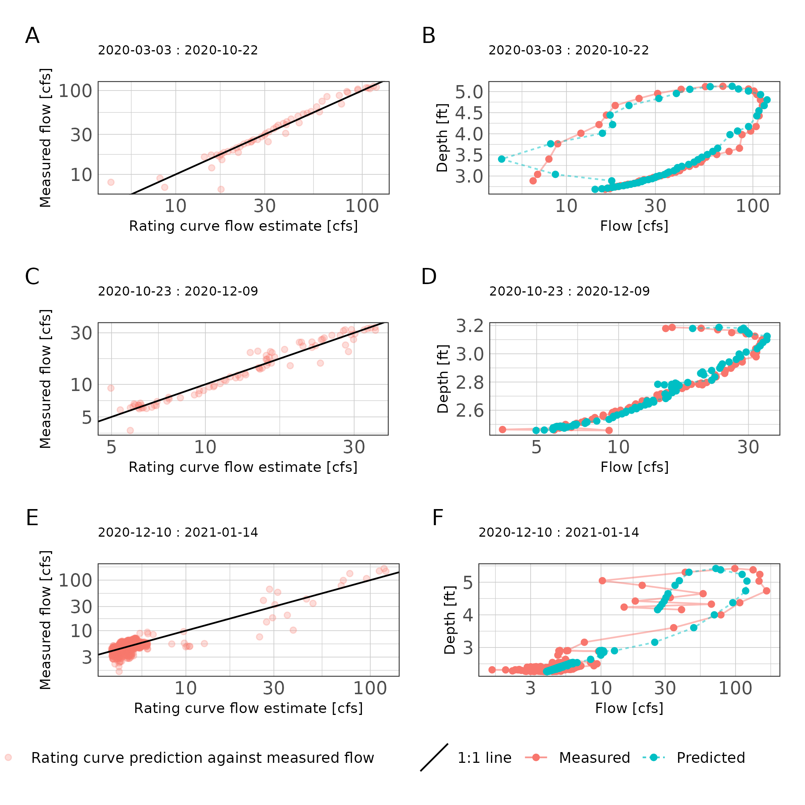
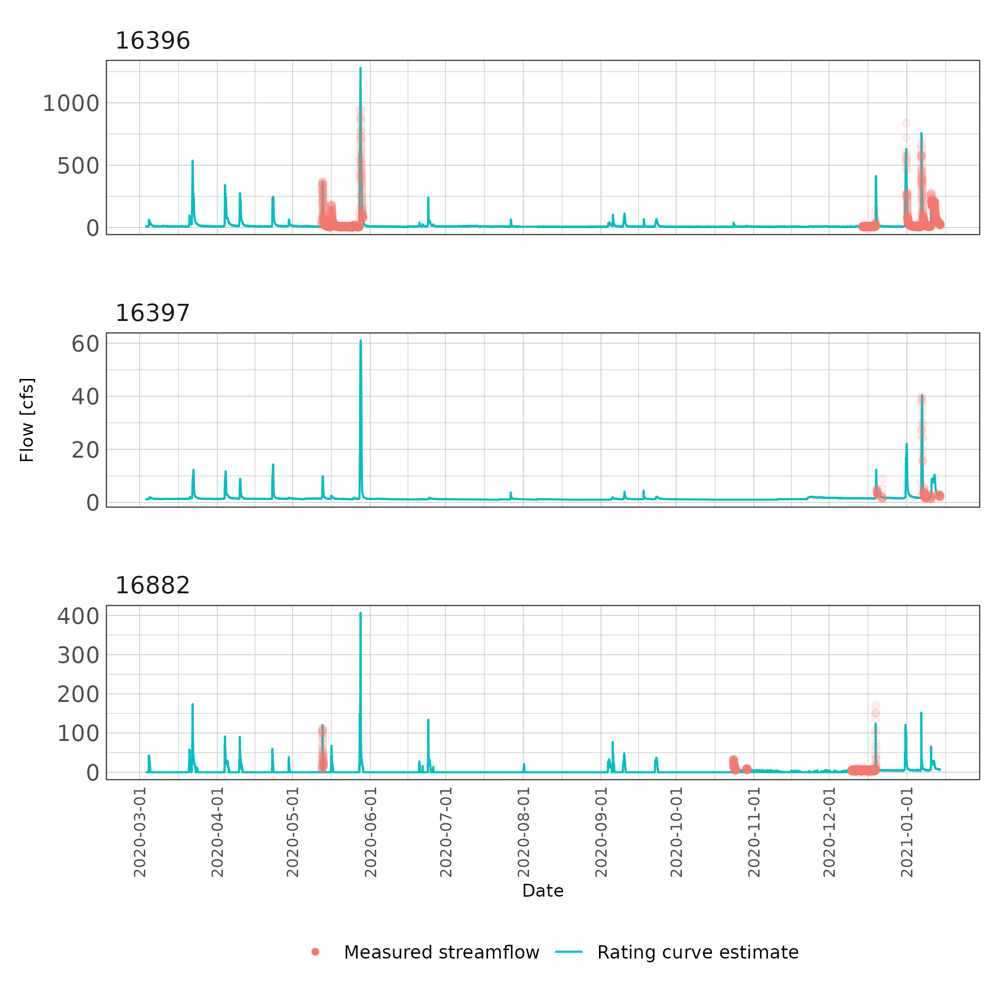

```r
## readr imports data
library(readr)
library(tidyr)
## tibbles are advanced fancy dataframes
library(tibble)
## dplyr for data handling and piping functions
library(dplyr)
## ggplot for plots
library(ggplot2)
## stringr to read and manipulate strings
library(stringr)
## here is a function to ensure file paths are correct
library(here)
## units and ggforce facilitate attaching units to data
library(units)
library(ggforce)
## hrbrtheme is optional, I use it to pretty my plots
library(hrbrthemes)
## patchwork support arranging multiple ggplots into one plot
library(patchwork)
## lubridate provides functions for handling time and date
library(lubridate)
## purrr lets us use map_ functions as an alternative to loops
library(purrr)
## hydroGOF provide goodness of fit metrics (NSE, RMSE, etc.)
library(hydroGOF)
## tsibble and imputeTS will allow some simple time series interpolation
library(tsibble)
library(imputeTS)
## gt
library(gtsummary)
## nls.multstart fits non-linear least squares using the Levenberg-Marquardt algorithm with multiple starting values.
library(nls.multstart)

## set some options
update_geom_font_defaults(font_rc)
units_options(parse = FALSE)


## some custom functions
theme_ms <- function(...) {
  theme_ipsum_rc(plot_margin = margin(10,10,10,10),
              axis_title_just = "c") +
    theme(legend.position = "bottom",
          panel.background = element_rect(fill = "white", 
            colour = NA), 
          panel.border = element_rect(fill = NA, 
            colour = "grey20"),
          ...)
}

exponent <- function(x, pow) {
  (abs(x)^pow)*sign(x)
}
```

## About

This document walks through some exploratory data analysis to develop rating curves and streamflow predictions on Thompsons Creek. The purpose is to utilize (1) instantaneous streamflows measured during periodic deployments of bottom mounted doppler units and (2) instantaneous depth measurements from water level data loggers deployed long-term in-stream to create and update rating curves. The rating curves will be utilized to calculate streamflow over the HOBO pressure transducer deployment period (approximately 1-yr). The resulting data will be used to create and validate regression and DAR streamflow estimates in Thompsons creek over a 10-15 year period.

## Introduction


### Rating curves

Due to the high costs associated with continuous in-stream measurements of stream discharge, it is preferable to estimate discharge using stream height measurements. Continuous measurements of stream height can be accomplished inexpensively using pressure transducers. When supplemented with periodic discharge measurements, a power function can relate stream height and discharge [@venetis1970note]:

\begin{equation}
  Q = K(H-H_0)^z
  (\#eq:powerfunction)
\end{equation} 
where:
$Q$ represents steady state discharge, $H$ represents stream height (stage), $H_0$ is the stage at zero discharge; $K$ and $z$ are rating curve constants. Following convention, $Q$ and $H$ are often log-transformed prior to parameter estimation.

Unsteady flows occur when the rising and falling stages of a stream hydrograph result in different discharges at identical stream heights. This resulting hysteresis-affected rating curve will present as a loop as opposed to a line. The modified Jones formula described by @petersen-overleir_modelling_2006 and @zakwan_spreadsheet-based_2018 may be used:

\begin{equation}
  Q = K(h-a)^n\times\sqrt{1 + x\frac{\partial h}{\partial t}}
  (\#eq:Jonesformula)
\end{equation} 

where $Q$ is discharge and $h$ is stream height. The partial first order derivative$\frac{\partial h}{\partial t}$ is approximated as $J$ using finite differences:

\begin{equation}
J(h_t) = (h_{t+1}-h_{t-1})/\Delta t
  (\#eq:finitediff)
\end{equation} 

where $h_t$ is the stream height at time $t$ and $\Delta t$ is the time interval. This can be considered the slope or instantaneous rate of change for the function between stream height and time which is estimated using measured stream height values. $K$, $a$, $n$, and $x$ are rating curve constants.

A number of different methods are available to solve for the rating curve parameters. We use non-linear least squares regression to minimize the residual sum of square error (SSE) of the rating curve parameters. The residual SSE is calculated as:

\begin{equation}
SSE = \sum\limits_{i=1}^N[X-Y]^2
  (\#eq:sseformula)
\end{equation} 

where:
$X$ is the measured value and $Y$ is the predicted value. Nonlinear optimization methods search though parameter combinations to minimize the objective function (residual SSE in this case). @petersen2006modelling applied the Nelder-Mead algorithm to solve the Jones formula. @zakwan_spreadsheet-based_2018 present spreadsheet based nonlinear optimization methods using generalized reduced gradient and genetic algorithm. Most methods require careful planning for parameter starting values that are somewhat near the global minimum value or risk identifying a alternative local minimum values. To reduce the likelihood of convergence on local minimum, the `nls.multstart` package in `R` provides functionality to iterate non-linear least squares optimization over many different starting values [@padfield_2020]. 

### Ungaged streamflow estimation

Rating curves allowed development of daily streamflow records for the period of time that stream depth data recorders were deployed. However, estimation of daily streamflows when sites are ungaged requires additional information. Most commonly, daily streamflow data from a nearby gaged watershed is used to estimate flows in the ungaged watershed using a drainage area ratio or regression methods. With the drainage area ratio, daily streamflows are transferred from one basin to the other by multiplying the area ratio to daily streamflows:

\begin{equation}
Q_y^t = Q_x^t\bigg(\frac{A_y}{A_x}\bigg)^\phi
  (\#eq:dar)
\end{equation}

Where $Q_y^t$ is streamflow at ungaged basin $y$ and time $t$, $Q_x^t$ is streamflow at gaged basin $x$ and time $t$, and $\frac{A_y}{A_x}$ is the area ratio of the basins. Parameter $\phi$ is typically equal to one  [@asquith_statewide_2006]. However, @asquith_statewide_2006 provides empirically estimated values of $\phi$ for use in the drainage area ratio when applied in Texas. 

## Method

### Data collection

Water level data loggers (HOBO U20 Series Water Level Data Loggers) were deployed at TCEQ SWQM stations 16396, 16397, and 16882 (Table \@ref(tab:hoboimport), Figure \@ref(fig:hoboplot)). An additional data logger was deployed at ... to provide ambient atmospheric pressure corrections for the data loggers deployed underwater. Water level data loggers were deployed near continuously from 2020-03-02 through 2021-..-... and setup to record water level at 15-minute intervals.


```r
## make a list of files to import
file_paths <- paste0(here("Data/Hobo"),
                     "/",
                     list.files(path = here("Data/Hobo"),
                                pattern = ".csv"))

## create a blank tibble to fill
hobo_df <- tibble()


## loop through file paths to read each file
for (i in file_paths) {
  x <- read_csv(
    i,
    skip = 2,
    col_names = c(
      "Row",
      "Date",
      "Time",
      "Abs_Pres",
      "Temp",
      "Bar_Pressure",
      "Water_Level",
      "Coupler_Detached",
      "Coupler_Attached",
      "Stopped",
      "EOF"
    ),
    col_types = "nccnnnncccc"
  )
  x$file <- i
  hobo_df <- bind_rows(hobo_df, x)
  rm(x)
}

## clean up the dataframe
hobo_df <- hobo_df %>%
  mutate(
    ## regex extracts site number from file path
    Site = str_extract(file, "\\d{1,6}"),
    
    ## convert date and time columns to date/time format
    dt = paste(Date, Time),
    Date_Time = as.POSIXct(paste(Date, Time),
                           tz = "Etc/GMT-6",
                           format = "%m/%d/%y %I:%M:%S %p")) %>%
  mutate(Site = as.factor(Site)) %>%
  ## select the columns we need to keep
  dplyr::select(Abs_Pres, Temp, Water_Level, Site, Date_Time) %>%
  ## filter rows without water_level
  dplyr::filter(!is.na(Water_Level)) %>%
  ## filter records that are from when unit was placed or removed from water
  filter(
    Site == "16882" & Date_Time >= as.POSIXct("2020-03-03 10:19:16", tz = "Etc/GMT-6") & 
      Date_Time != as.POSIXct("2020-07-30 10:19:16", tz = "Etc/GMT-6") |
      Site == "16397" & Date_Time >= as.POSIXct("2020-03-03 09:43:57",tz = "Etc/GMT-6")  &
      Date_Time != as.POSIXct("2021-01-14 09:13:57", tz = "Etc/GMT-6") |
      Site == "16396" & Date_Time >= as.POSIXct("2020-03-03 09:02:19", tz = "Etc/GMT-6") &
      Date_Time != as.POSIXct("2021-01-14 08:17:19", tz = "Etc/GMT-6")
  ) 
  
## attach units to our columns
units(hobo_df$Water_Level) <- as_units("ft")
units(hobo_df$Temp) <- as_units("°F")
units(hobo_df$Abs_Pres) <- as_units("psi")

## report summary stats
hobo_df %>% 
  select(Site, Water_Level) %>%
  mutate(Water_Level = as.numeric(Water_Level)) %>%
  tbl_summary(by = Site,
              label = list(Water_Level = "Stream Height"),
              digits = list(Water_Level = 2),
              statistic = list(all_continuous() ~ "{mean} ({sd})")) %>%
  modify_header(label = "**Variable**") %>%
  modify_spanning_header(all_stat_cols() ~ "**Sites**") %>%
  modify_caption("Summary statistics of 15 minute stream levels measured at each site.") %>%
  as_kable()
```


Table: (\#tab:hoboimport)Summary statistics of 15 minute stream levels measured at each site.

|**Variable**  |**16396**, N = 29,749 |**16397**, N = 29,748 |**16882**, N = 30,428 |
|:-------------|:---------------------|:---------------------|:---------------------|
|Stream Height |1.90 (0.74)           |1.53 (0.85)           |2.46 (0.41)           |


```r
ggplot(hobo_df) +
  geom_line(aes(Date_Time, Water_Level)) +
  facet_wrap(~Site, ncol = 1, scales = "free_y") +
  scale_x_datetime("Date", date_breaks = "1 month",
                   date_labels = "%F") +
  scale_y_unit("Depth") +
  guides(x = guide_axis(angle = 90)) +
  theme_ms() +
  theme(axis.text.x = element_text(size = 8))
```

<div class="figure">

<p class="caption">(\#fig:hoboplot)Fifteen minute interval stream depth records at each site.</p>
</div>


Periodic streamflow measurements were made at each SWQM site using a bottom-mounted multi-beam Doppler flow meter (Son-Tek IQ Plus) (Figure \@ref(iqimport)). The Son-Tek IQ Plus measures cross sectional area, stream height, and velocity. Using these measurements, the device utilizes an index velocity method to report instantaneous discharge. The streamflow measurement device were deployed for a few days at a time to capture the full hydrograph under varying flow conditions at each SWQM station. Only two Doppler flow meters were available, so deployments rotated between stations. Additionally, one device stopped working and was under repair for a few months. Streamflow was recorded at 15-minute intervals.

During data exploration it was evident there was excess noise in the data at low flows for each station. During periods of stagnant or near stagnant conditions the doppler flow meters recorded highly variable stream velocities and reported unrealistic flows. Due to the excess data noise, periods of extreme low or stagnant flow were cleaned from the data record. Future deployments will need to consider under what conditions long term deployments are appropriate. For small streams such as these, periodic storm flow deployments are likely the most appropriate deployment.


```r
## make a list of files to import
file_paths <- paste0(here("Data/IQPlus"),
                     "/",
                     list.files(path = here("Data/IQPlus"),
                                pattern = ".csv"))

## create a blank tibble to fill
iqplus_df <- tibble()

## loop through file paths to read each file
for (i in file_paths) {
  x <- read_csv(
    i,
    col_types = "nc______n__n______________________nn______n_________"
  )
  x$file <- i
  iqplus_df <- bind_rows(iqplus_df, x)
  rm(x)
}


iqplus_df <- iqplus_df %>%
    mutate(
    ## regex extracts site number from file path
    Site = str_extract(file, "\\d{1,6}")) %>%
  ## use `dplyr::` to specify which rename function to use, just in case
  dplyr::rename(Sample_Number =`Sample number`,
                Date_Time = `Sample time`,
                Depth = `Depth (ft)`,
                Flow = `Flow (ft³/s)`,
                System_In_Water = `System in water (%)`,
                System_Status = `System status (status codes)`,
                Index_Velocity = `Velocity (mean) (ft/s)`) %>%
  dplyr::select(-c(Sample_Number, file)) %>%
  mutate(Date_Time = as.POSIXct(Date_Time,
                                tz = "Etc/GMT-6",
                                format = "%Y-%m-%d %H:%M:%S"))


## attach units to our columns
units(iqplus_df$Depth) <- as_units("ft")
units(iqplus_df$Flow) <- as_units("ft^3/s")
units(iqplus_df$Index_Velocity) <- as_units("ft/s")

## some data cleaning
iqplus_df %>%
  filter(System_Status == 0,
         System_In_Water == 100,
         #as.numeric(Depth) >= 0.26, ## minimum operating depth
         as.numeric(Flow) > 0) %>%
  filter(Site == "16396" &
           Date_Time >= as.POSIXct("2020-05-03", tz = "Etc/GMT-6") &
           Date_Time <= as.POSIXct("2020-05-31", tz = "Etc/GMT-6") &
           as.numeric(Depth) >= 0.875 |
           Site == "16396" &
           Date_Time >= as.POSIXct("2020-12-01", tz = "Etc/GMT-6") &
           Date_Time <= as.POSIXct("2021-01-31", tz = "Etc/GMT-6") &
           as.numeric(Depth) >= 0.875 |
           Site == "16397" &
           Date_Time >= as.POSIXct("2020-12-15", tz = "Etc/GMT-6") &
           Date_Time <= as.POSIXct("2020-12-31", tz = "Etc/GMT-6") &
           as.numeric(Depth) >= 0.875 |
           Site == "16397" &
           Date_Time >= as.POSIXct("2021-01-05", tz = "Etc/GMT-6") &
           as.numeric(Depth) >= 0.875 |
           # as.numeric(Depth) > 2 |
           Site == "16882" &## possible sedimentation at low flows, removing low flow measurements.
           Date_Time >= as.POSIXct("2020-05-01", tz = "Etc/GMT-6") &
           Date_Time < as.POSIXct("2020-06-01", tz = "Etc/GMT-6") &
           as.numeric(Depth) >= 0.875 |
           Site == "16882" & ## possible sedimentation at low flows, removing low flow measurements.
           Date_Time >= as.POSIXct("2020-10-11", tz = "Etc/GMT-6") &
           Date_Time < as.POSIXct("2020-10-31", tz = "Etc/GMT-6") & 
           as.numeric(Depth) >= 0.875 |
           Site == "16882" &
           Date_Time >= as.POSIXct("2020-12-10", tz = "Etc/GMT-6") &
           Date_Time < as.POSIXct("2020-12-31", tz = "Etc/GMT-6")) -> iqplus_df


ggplot(iqplus_df) +
  geom_point(aes(Date_Time, Flow), alpha = 0.2) +
  facet_wrap(~Site, ncol = 1, scales = "free_y") +
  labs(x = "Date") +
  theme_ms()
```

<div class="figure">

<p class="caption">(\#fig:iqimport)Period of recorded data at each station.</p>
</div>


```r
## In order to join the hobo measured depth to the IQ streamflow measurements
## we need to interpolate measured Depth to every minute because the depths are
## offset. Then we can join the data. we will use linear interpolation.

## I need a pipe friendly function that assigns an attribute to 
## a tibble (tsibble) and returns a tibble (tsibble)
pipe_attr <- function(df) {
  attr(df, "interval") <- new_interval(minute = 1)
  return(df)
}

## use purrr::map to run interpolation on each site
hobo_df %>%
  split(.$Site) %>%
  map(~dplyr::mutate(.x, Date_Time = round_date(.x$Date_Time, unit = "minute"))) %>%
  map(~as_tsibble(.x, key = Site, index = Date_Time)) %>%
  map(~pipe_attr(.x)) %>%
  map(~fill_gaps(.x)) %>%
  map(~mutate(.x, Water_Level = na_interpolation(as.numeric(Water_Level), option = "linear"))) %>%
  bind_rows() %>%
  as_tibble() %>%
  select(Water_Level, Site, Date_Time) -> hobo_df_interpolated

## replace Depth in iqplus_df with Water_Level reading from Hobo
## this is the dataframe we will develop rating curves from.
iqplus_df %>%
  left_join(hobo_df_interpolated, by = c("Site" = "Site", "Date_Time" = "Date_Time")) %>%
  select(Date_Time, Flow, System_In_Water, System_Status, Site, Water_Level) %>%
  rename(Depth = Water_Level) %>%
  mutate(Depth = set_units(Depth, "ft")) -> iqplus_df
```


### Rating curve development

In-stream and stream bank conditions change through the year due to plant growth, plant dieback, sedimentation, erosion, and other processes. These changing conditions can necessitate the development of multiple rating curves. Exploratory data analysis was used to identify periods of change and the potential for hysteresis affected rating curves. Once rating curve periods and appropriate formulas were determined, rating curve parameters in formulas \@ref(eq:powerfunction) and \@ref(eq:Jonesformula)  were estimated by non-linear least squares regression using the `nls.multstart` package in `R` [@padfield_2020]. This method utilizes the Levenberg-Marquardt algorithm and multiple starting values to find the global minimum SSE value. 

Individual rating curves were used to estimate streamflows using the measured stream heights. Nash-Sutcliffe Efficiency (NSE) and normalized Root Mean Square Error was used to evaluate goodness-of-fit between measured and estimated streamflow. NSE is a normalized statistic that evaluates the relative residual variance against the measured data variance and is calculated as:

\begin{equation}
NSE = 1 - \frac{\sum_{t=1}^T(\hat{Q}_t-Q_t)^2}{\sum_{t=1}^T(Q_t-\bar{Q})^2}
  (\#eq:nseformula)
\end{equation} 

Where $\bar{Q}$ is the mean of observed discharges, $\hat{Q}_t$ is the estimated discharge at time $t$, and $Q_t$ is observed discharge at time $t$. Values of NSE range from $-\infty$ to 1, where 1 indicates perfect predictive performance. NSE of zero indicates the model has the same predictive performance as the mean of the dataset.

The nRMSE is a percentage based metric that describes the difference between predicted and measured discharge values:

\begin{equation}
nRMSE = \frac{RMSE}{Q_{max}-Q_{min}}, \quad \textrm{where} \quad RMSE = \sqrt{\frac{\sum_{t=1}^{n}{(Q_t-\hat{Q}_t)^2}}{n}}
  (\#eq:nRMSE)
\end{equation}

Where $Q_t$ is the observed discharge at time $t$, $\hat{Q}_t$ is the estimated discharge at time $t$, $n$ is the number of samples, $Q_{max}$ and $Q_{min}$ are the maximum and minimum observed discharges. The resulting nRMSE calculation is a percentage value.


## Results

### Site 16396

Based on exploratory analysis, two rating curves were developed for site 16396. The rating curve periods were 2020-03-03 through 2020-11-30 and 2020-12-01 through 2021-01-31. Due to apparent unsteady flow in the observed hydrogaphs, we applied the Jones formula (Formula\@ref(eq:Jonesformula)). Both time periods resulted in a rating curve with NSE greater than 0.97 and nRMSE less than 3% indicating excellent fit (Table \@ref(tab:results16369); Figure \@ref(fig:metricplot16396)). Figure \@ref(fig:metricplot16396) does indicate some biased flow estimates at extremely low flow measurements. This is attributed to variability in flows recorded by the doppler flow meter at low flows. 


```r
## Make dataframe for site 16396 before december 

iqplus_df %>%
  filter(Site == "16396",
         Date_Time < as.POSIXct("2020-12-01", tz = "Etc/GMT-6")) %>%
  arrange(Date_Time) %>%
  mutate(time_lag = lag(Date_Time, default = Date_Time[1]),
         diff_time = as.numeric(difftime(Date_Time, time_lag, units = "hours"))) %>%
  group_split(cumsum(diff_time > 8)) %>%
  ## remove events where max flow did not go over 10 cfs
  keep(~ max(as.numeric(.x$Flow)) > 10) %>%
  map(~select(.x, Date_Time, Depth, Flow)) %>%
  map(~mutate(.x,
              time_lag = lag(Date_Time, default = Date_Time[1]),
              time_lead = lead(Date_Time),
              diff_time = as.numeric(difftime(time_lead,time_lag, units = "hours")),
              diff_depth = lead(Depth) - lag(Depth))) %>%
  imap(~mutate(.x, event = as.character(.y))) %>%
  bind_rows() %>%
  filter(!is.na(diff_depth)) %>%
  mutate(J = as.numeric(diff_depth)/as.numeric(diff_time)) -> df_16396_2020_03

## Make dataframe for site 16396 Dec 2020 through January 2021
iqplus_df %>%
  filter(Site == "16396",
         Date_Time >= as.POSIXct("2020-12-01", tz = "Etc/GMT-6") &
            Date_Time < as.POSIXct("2021-02-01", tz = "Etc/GMT-6")) %>%
  arrange(Date_Time) %>%
  mutate(time_lag = lag(Date_Time, default = Date_Time[1]),
         diff_time = as.numeric(difftime(Date_Time, time_lag, units = "hours"))) %>%
  group_split(cumsum(diff_time > 8)) %>%
  ## remove events where max flow did not go over 10 cfs
  keep(~ max(as.numeric(.x$Flow)) > 10) %>%
  map(~select(.x, Date_Time, Depth, Flow)) %>%
  map(~mutate(.x,
              time_lag = lag(Date_Time, default = Date_Time[1]),
              time_lead = lead(Date_Time),
              diff_time = as.numeric(difftime(time_lead,time_lag, units = "hours")),
              diff_depth = lead(Depth) - lag(Depth))) %>%
  imap(~mutate(.x, event = as.character(.y))) %>%
  bind_rows() %>%
  filter(!is.na(diff_depth)) %>%
  mutate(J = as.numeric(diff_depth)/as.numeric(diff_time)) -> df_16396_2020_12
```


```r
## use nls to estimate parameters in Jones formula
jones_form <- formula(log(as.numeric(Flow)) ~ K*exponent(x = log(as.numeric(Depth)) - a, pow = n) * exponent(x = (1 + x * J), pow = (1/2)))

## some starting paremeters. nls_multstart will use multiple
## starting parameters and model selection to find 
## global minimum
start_lower <- list(K = 0, a = 0, n = 0, x = -5)
start_upper <- list(K = 10, a = 10, n = 5, x = 5)
## fit nls
rc_16396_2020_03 <- nls_multstart(jones_form,
              data = df_16396_2020_03,
              iter = 1000,
              start_lower = start_lower,
              start_upper = start_upper,
              convergence_count = FALSE,
              supp_errors = "Y")

## set parameter starting limits
start_lower <- list(K = -100, a = 0, n = 0, x = -5000)
start_upper <- list(K = 100, a = 1000, n = 50, x = 5000)
## fit nls
rc_16396_2020_12 <- nls_multstart(jones_form,
              data = df_16396_2020_12,
              iter = 1000,
              start_lower = start_lower,
              start_upper = start_upper,
              convergence_count = FALSE,
              supp_errors = "Y")
```


```r
## setup dataframe with parameter results. Will use this later to report parameters and GOF metrics
df_results_16369 <- tibble(Site = c("16396","16396"),
                           Period = c("2020-03-01 : 2020-11-30",
                                      "2020-12-01 : 2021-01-31"),
                           K = c(coefficients(rc_16396_2020_03)[["K"]],
                                 coefficients(rc_16396_2020_12)[["K"]]),
                           a = c(coefficients(rc_16396_2020_03)[["a"]],
                                 coefficients(rc_16396_2020_12)[["a"]]),
                           n = c(coefficients(rc_16396_2020_03)[["n"]],
                                 coefficients(rc_16396_2020_12)[["n"]]),
                           x = c(coefficients(rc_16396_2020_03)[["x"]],
                                 coefficients(rc_16396_2020_12)[["x"]]))
```


```r
## Develop rating curve predictions and
## create table with GOF metrics
df_16396_2020_03 %>%
  filter(!is.na(J)) %>%
  mutate(predicted = exp(predict(rc_16396_2020_03, .))) -> df_16396_2020_03

df_16396_2020_12 %>%
    filter(!is.na(J)) %>%
  mutate(predicted =  exp(predict(rc_16396_2020_12, .))) -> df_16396_2020_12


df_results_16369 %>%
  mutate(NSE = c(
    hydroGOF::NSE(df_16396_2020_03$predicted, as.numeric(df_16396_2020_03$Flow)),
    hydroGOF::NSE(df_16396_2020_12$predicted, as.numeric(df_16396_2020_12$Flow))),
    nRMSE = c(hydroGOF::nrmse(df_16396_2020_03$predicted, as.numeric(df_16396_2020_03$Flow), norm = "maxmin"),
              hydroGOF::nrmse(df_16396_2020_12$predicted, as.numeric(df_16396_2020_12$Flow), norm = "maxmin"))
    ) -> df_results_16369

##display table
kable(df_results_16369, 
      caption = "Rating curve parameter estimates and goodness-of-fit metrics for station 16369.") 
```


Table: (\#tab:results16369)Rating curve parameter estimates and goodness-of-fit metrics for station 16369.

|Site  |Period                  |        K|         a|         n|          x|       NSE| nRMSE|
|:-----|:-----------------------|--------:|---------:|---------:|----------:|---------:|-----:|
|16396 |2020-03-01 : 2020-11-30 | 4.700924| 0.3324034| 0.5018387| -0.1250084| 0.9793704|   1.7|
|16396 |2020-12-01 : 2021-01-31 | 4.393037| 0.1779943| 0.6566228|  0.0979444| 0.9779388|   2.0|


```r
## plot rating curve results

p1 <- ggplot(df_16396_2020_03) +
    geom_point(aes(as.numeric(predicted), as.numeric(Flow), color = "Rating curve prediction against measured flow"), alpha = 0.25) +
  geom_abline(aes(slope = 1, intercept = 0, linetype = "1:1 line")) +
  scale_x_continuous(name = "Rating curve flow estimate [cfs]", trans = "log10") +
  scale_y_continuous(name = "Measured flow [cfs]", trans = "log10") +
  theme_ms() + labs(subtitle = "March-November") +
  theme(legend.title = element_blank(),
        legend.position = "none")

p2 <- ggplot(df_16396_2020_03) +
  geom_point(aes(as.numeric(Flow), Depth, color = "Measured")) +
  geom_path(aes(as.numeric(Flow), Depth, color = "Measured", linetype = "Measured"),
            alpha = 0.5) +
  geom_point(aes(as.numeric(predicted), Depth, color = "Predicted")) +
  geom_path(aes(as.numeric(predicted), Depth, color = "Predicted", linetype = "Predicted"),
            alpha = 0.5) +
  scale_color_discrete("") + scale_linetype_discrete("") +
  scale_x_continuous("Flow [cfs]", trans = "log10") +
  labs(subtitle = "March-November") + theme_ms() + theme(legend.position = "none")

p3 <- ggplot(df_16396_2020_12) +
    geom_point(aes(as.numeric(predicted), as.numeric(Flow), color = "Rating curve prediction against measured flow"), alpha = 0.25) +
  geom_abline(aes(slope = 1, intercept = 0, linetype = "1:1 line")) +
  scale_x_continuous(name = "Rating curve flow estimate [cfs]", trans = "log10") +
  scale_y_continuous(name = "Measured flow [cfs]", trans = "log10") +
  theme_ms() + labs(subtitle = "December-January") +
  theme(legend.title = element_blank())

p4 <- ggplot(df_16396_2020_12) +
  geom_point(aes(as.numeric(Flow), Depth, color = "Measured")) +
  geom_path(aes(as.numeric(Flow), Depth, color = "Measured", linetype = "Measured"),
            alpha = 0.5) +
  geom_point(aes(as.numeric(predicted), Depth, color = "Predicted")) +
  geom_path(aes(as.numeric(predicted), Depth, color = "Predicted", linetype = "Predicted"),
            alpha = 0.5) +
  scale_color_discrete("") + scale_linetype_discrete("") +
  scale_x_continuous("Flow [cfs]", trans = "log10") +
  labs(subtitle = "December-January") + theme_ms()

(p1 + p2) / (p3 + p4) + plot_annotation(tag_levels = "A")
```

<div class="figure">

<p class="caption">(\#fig:metricplot16396)Scatter plot of rating curve estimated flows against measured flows (A, C) and stage discharge predictions (B, D) for each rating curve period at station 16396.</p>
</div>


### Site 16397

Exploratory analysis indicated pooled conditions when during doppler flow meter deployment from August 2020 through November 2020. A single rating curve was developed at this site using the power function (Formula \@ref(eq:powerfunction)) since unsteady flow conditions were not observed in the hydrographs. Rating curve predictions resulted in NSE greater than 0.95 indicating excellent fit (Table \@ref(tab:results16369)). The nRMSE was less than 5%, which is likely a good result for the smaller sample sized obtained at this station and probably influenced by the observed low flow variance (Table \@ref(tab:results16369); Figure \@ref(fig:metricplot16396)).


```r
## setup dataframe to fit rating curve to 16397

iqplus_df %>%
  filter(Site == "16397") %>%
  arrange(Date_Time) %>%
  mutate(time_lag = lag(Date_Time, default = Date_Time[1]),
         diff_time = as.numeric(difftime(Date_Time, time_lag, units = "hours"))) %>%
  group_split(cumsum(diff_time > 8)) %>%
  map(~select(.x, Date_Time, Depth, Flow)) %>%
  map(~mutate(.x,
              time_lag = lag(Date_Time, default = Date_Time[1]),
              diff_time = as.numeric(difftime(Date_Time, time_lag, units = "hours")),
              diff_depth = c(0, diff(.x$Depth)))) %>%
  imap(~mutate(.x, event = as.character(.y))) %>%
  bind_rows() %>%
  filter(!is.na(diff_depth)) %>%
  mutate(J = as.numeric(diff_depth)/as.numeric(diff_time)) -> df_16397

## power function
power_form <- formula(log(as.numeric(Flow)) ~ K*(log(as.numeric(Depth)) - H_0)^Z)

## parameter starting limits
start_lower <- list(K = -10, Z = 0.0001, H_0 = 0.0001)
start_upper <- list(K = 10, Z = 10, H_0 = 8)
rc_16397 <- nls_multstart(power_form,
              data = df_16397,
              iter = 1000,
              start_lower = start_lower,
              start_upper = start_upper,
              convergence_count = FALSE,
              supp_errors = "Y")
```


```r
## setup dataframe with parameter results. Will use this later to report parameters and GOF metrics
df_results_16397 <- tibble(Site = c("16397"),
                           Period = c("2020-03-01 : 2020-01-30"),
                           K = coefficients(rc_16397)[["K"]],
                           H_0 = coefficients(rc_16397)[["H_0"]],
                           Z = coefficients(rc_16397)[["Z"]])
```


```r
df_16397 %>%
  mutate(predicted = exp(predict(rc_16397, .))) -> df_16397


df_results_16397 %>%
  mutate(NSE = hydroGOF::NSE(df_16397$predicted, as.numeric(df_16397$Flow)),
         nRMSE = hydroGOF::nrmse(df_16397$predicted, as.numeric(df_16397$Flow),
                              norm="maxmin")) -> df_results_16397

kable(df_results_16397,
      caption = "Rating curve parameter estimates and goodness-of-fit metrics for station 16397.")
```


Table: (\#tab:results16397)Rating curve parameter estimates and goodness-of-fit metrics for station 16397.

|Site  |Period                  |         K|       H_0|        Z|       NSE| nRMSE|
|:-----|:-----------------------|---------:|---------:|--------:|---------:|-----:|
|16397 |2020-03-01 : 2020-01-30 | 0.0008322| -2.402912| 5.658475| 0.9519032|   4.9|


```r
## plot rating curve results
p1 <- df_16397 %>%
  mutate(predicted = set_units(predicted, "ft^3/s")) %>%
  ggplot() +
  geom_point(aes(as.numeric(predicted), as.numeric(Flow), color = "Rating curve prediction against measured flow"), alpha = 0.9) +
  geom_abline(aes(slope = 1, intercept = 0, linetype = "1:1 line")) +
  scale_x_continuous(name = "Rating curve flow estimate [cfs]", trans = "log10") +
  scale_y_continuous(name = "Measured flow [cfs]", trans = "log10") +
  theme_ms() +
  theme(legend.title = element_blank())

p2 <- ggplot(df_16397) +
  geom_point(aes(as.numeric(Flow), Depth, color = "Measured")) +
  geom_point(aes(as.numeric(predicted), Depth, color = "Predicted")) +
  scale_color_discrete("") +
  scale_x_continuous("Flow [cfs]", trans = "log10") + theme_ms()

p1 + p2 + plot_annotation(tag_levels = "A")
```

<div class="figure">

<p class="caption">(\#fig:metricplot16397)Scatter plot of rating curve estimated flows against measured flows (A) and stage discharge predictions (B) for station 16397.</p>
</div>

### Site 16882

Based on exploratory analysis, three rating curves were developed for site 16396. The rating curve periods were 2020-03-03 through 2020-05-30; 2020-06-01 through 2020-10-31; and 2020-11-01 through 2021-01-31. Due to apparent unsteady flow in the observed hydrogaphs, we applied the Jones formula (Formula\@ref(eq:Jonesformula)). Results for March through September indicate the rating curve had a very good fit (NSE > 0.96, nRMSE <6%; Table \@ref(tab:results16882)). The high variance between observed and predicted values at low flows is attributable to an event with an extremely fast stream height change (> 1.5 feet per hour) that parameter estimation had difficulty accommodating (Figure \@ref(fig:metricplot16882)). Goodness of fit metrics for the remaining rating curves decreased but at still indicate good performance (Table \@ref(tab:results16882)). High variance in the measured low and mid streamflow values impact rating curve performance (Figure \@ref(fig:metricplot16882)).


```r
## make 3 different dataframes to fit jones formula to.

iqplus_df %>%
  filter(Site == "16882") %>%
    filter(Date_Time > as.POSIXct("2020-05-01", tz = "Etc/GMT-6") &
           Date_Time < as.POSIXct("2020-05-31", tz = "Etc/GMT-6")) %>%
  arrange(Date_Time) %>%
  mutate(time_lag = lag(Date_Time, default = Date_Time[1]),
         diff_time = as.numeric(difftime(Date_Time, time_lag, units = "hours"))) %>%
  #filter(as.numeric(Depth) >= 2.36) %>%
  group_split(cumsum(diff_time > 8)) %>%
  ## remove events where max flow did not go over 10 cfs
  #keep(~ max(as.numeric(.x$Flow)) > 10) %>%
  map(~select(.x, Date_Time, Depth, Flow)) %>%
  map(~mutate(.x,
              time_lag = lag(Date_Time, default = Date_Time[1]),
              time_lead = lead(Date_Time),
              diff_time = as.numeric(difftime(time_lead,time_lag, units = "hours")),
              diff_depth = lead(Depth) - lag(Depth))) %>%
  imap(~mutate(.x, event = as.character(.y))) %>%
  bind_rows() %>%
  filter(!is.na(diff_depth)) %>%
  mutate(J = as.numeric(diff_depth)/as.numeric(diff_time)) -> df_16882_2020_03

iqplus_df %>%
  filter(Site == "16882") %>%
    filter(Date_Time > as.POSIXct("2020-10-01", tz = "Etc/GMT-6") &
           Date_Time < as.POSIXct("2020-10-31", tz = "Etc/GMT-6")) %>%
  arrange(Date_Time) %>%
  mutate(time_lag = lag(Date_Time, default = Date_Time[1]),
         diff_time = as.numeric(difftime(Date_Time, time_lag, units = "hours"))) %>%
  group_split(cumsum(diff_time > 8)) %>%
  ## remove events where max flow did not go over 10 cfs
  keep(~ max(as.numeric(.x$Flow)) > 10) %>%
  map(~select(.x, Date_Time, Depth, Flow)) %>%
  map(~mutate(.x,
              time_lag = lag(Date_Time, default = Date_Time[1]),
              time_lead = lead(Date_Time),
              diff_time = as.numeric(difftime(time_lead,time_lag, units = "hours")),
              diff_depth = lead(Depth) - lag(Depth))) %>%
  imap(~mutate(.x, event = as.character(.y))) %>%
  bind_rows() %>%
  filter(!is.na(diff_depth)) %>%
  mutate(J = as.numeric(diff_depth)/as.numeric(diff_time)) -> df_16882_2020_10


iqplus_df %>%
  filter(Site == "16882") %>%
    filter(Date_Time >= as.POSIXct("2020-11-01", tz = "Etc/GMT-6") &
           Date_Time < as.POSIXct("2021-01-31", tz = "Etc/GMT-6")) %>%
  arrange(Date_Time) %>%
  mutate(time_lag = lag(Date_Time, default = Date_Time[1]),
         diff_time = as.numeric(difftime(Date_Time, time_lag, units = "hours"))) %>%
  group_split(cumsum(diff_time > 8)) %>%
  ## remove events where max flow did not go over 10 cfs
  keep(~ max(as.numeric(.x$Flow)) > 10) %>%
  map(~select(.x, Date_Time, Depth, Flow)) %>%
  map(~mutate(.x,
              time_lag = lag(Date_Time, default = Date_Time[1]),
              time_lead = lead(Date_Time),
              diff_time = as.numeric(difftime(time_lead,time_lag, units = "hours")),
              diff_depth = lead(Depth) - lag(Depth))) %>%
  imap(~mutate(.x, event = as.character(.y))) %>%
  bind_rows() %>%
  filter(!is.na(diff_depth)) %>%
  mutate(J = as.numeric(diff_depth)/as.numeric(diff_time)) -> df_16882_2020_12
```


```r
## estimate parameters for each dataset

## set parameter starting limits
start_lower <- list(K = 0, a = 0, n = 0, x = -5000)
start_upper <- list(K = 100, a = 1000, n = 50, x = 5000)

rc_16882_2020_03 <- nls_multstart(jones_form,
              data = df_16882_2020_03,
              iter = 1000,
              start_lower = start_lower,
              start_upper = start_upper,
              convergence_count = FALSE,
              supp_errors = "Y")

## set parameter starting limits
start_lower <- list(K = -100, a = 0, n = 0, x = -5000)
start_upper <- list(K = 100, a = 1000, n = 50, x = 5000)
rc_16882_2020_10 <- nls_multstart(jones_form,
              data = df_16882_2020_10,
              iter = 1000,
              start_lower = start_lower,
              start_upper = start_upper,
              convergence_count = FALSE,
              supp_errors = "Y")

## set parameter starting limits
start_lower <- list(K = 0, a = 0, n = 0, x = -5000)
start_upper <- list(K = 100, a = 1000, n = 50, x = 5000)
rc_16882_2020_12 <- nls_multstart(jones_form,
              data = df_16882_2020_12,
              iter = 1000,
              start_lower = start_lower,
              start_upper = start_upper,
              convergence_count = FALSE,
              supp_errors = "Y")
```


```r
## setup dataframe with parameter results. Will use this later to report parameters and GOF metrics
df_results_16882 <- tibble(Site = c("16882", "16882", "16882"),
                           Period = c("2020-03-01 : 2020-09-30",
                                      "2020-10-01 : 2020-11-30",
                                      "2020-12-01 : 2021-01-31"),
                           K = c(coefficients(rc_16882_2020_03)[["K"]],
                                 coefficients(rc_16882_2020_10)[["K"]],
                                 coefficients(rc_16882_2020_12)[["K"]]),
                           a = c(coefficients(rc_16882_2020_03)[["a"]],
                                 coefficients(rc_16882_2020_10)[["a"]],
                                 coefficients(rc_16882_2020_12)[["a"]]),
                           n = c(coefficients(rc_16882_2020_03)[["n"]],
                                 coefficients(rc_16882_2020_10)[["n"]],
                                 coefficients(rc_16882_2020_12)[["n"]]),
                           x = c(coefficients(rc_16882_2020_03)[["x"]],
                                 coefficients(rc_16882_2020_10)[["x"]],
                                 coefficients(rc_16882_2020_12)[["x"]]))

## Develop rating curve predictions and
## create table with GOF metrics


df_16882_2020_03 %>%
  filter(!is.na(J)) %>%
  mutate(predicted = exp(predict(rc_16882_2020_03, data = .))) -> df_16882_2020_03

df_16882_2020_10 %>%
  filter(!is.na(J)) %>%
  mutate(predicted = exp(predict(rc_16882_2020_10, data = .))) -> df_16882_2020_10

df_16882_2020_12 %>%
  filter(!is.na(J)) %>%
  mutate(predicted = exp(predict(rc_16882_2020_12, data = .))) -> df_16882_2020_12


df_results_16882 %>%
  mutate(NSE = c(
    hydroGOF::NSE(df_16882_2020_03$predicted, as.numeric(df_16882_2020_03$Flow)),
    hydroGOF::NSE(df_16882_2020_10$predicted, as.numeric(df_16882_2020_10$Flow)),
    hydroGOF::NSE(df_16882_2020_12$predicted, as.numeric(df_16882_2020_12$Flow))),
    nRMSE = c(hydroGOF::nrmse(df_16882_2020_03$predicted, as.numeric(df_16882_2020_03$Flow), norm = "maxmin"),
              hydroGOF::nrmse(df_16882_2020_10$predicted, as.numeric(df_16882_2020_10$Flow), norm = "maxmin"),
              hydroGOF::nrmse(df_16882_2020_12$predicted, as.numeric(df_16882_2020_12$Flow), norm = "maxmin"))
    ) -> df_results_16882

##display table
kable(df_results_16882,
      caption = "Rating curve parameter estimates and goodness-of-fit metrics for station 16882.")
```


Table: (\#tab:results16882)Rating curve parameter estimates and goodness-of-fit metrics for station 16882.

|Site  |Period                  |        K|         a|         n|          x|       NSE| nRMSE|
|:-----|:-----------------------|--------:|---------:|---------:|----------:|---------:|-----:|
|16882 |2020-03-01 : 2020-09-30 | 4.520613| 0.9598066| 0.1515910| -0.5764236| 0.9674766|   5.5|
|16882 |2020-10-01 : 2020-11-30 | 3.371444| 0.8957127| 0.1359091| -6.1282243| 0.8850142|  10.0|
|16882 |2020-12-01 : 2021-01-31 | 3.855323| 0.5431170| 0.7936082|  0.3829932| 0.8833267|   1.9|


```r
## plot rating curve results

p1 <- ggplot(df_16882_2020_03) +
    geom_point(aes(as.numeric(predicted), as.numeric(Flow), color = "Rating curve prediction against measured flow"), alpha = 0.25) +
  geom_abline(aes(slope = 1, intercept = 0, linetype = "1:1 line")) +
  scale_x_continuous(name = "Rating curve flow estimate [cfs]", trans = "log10") +
  scale_y_continuous(name = "Measured flow [cfs]", trans = "log10") +
  theme_ms() + labs(subtitle = "March-September") +
  theme(legend.title = element_blank(),
        legend.position = "none")

p2 <- ggplot(df_16882_2020_03) +
  geom_point(aes(as.numeric(Flow), Depth, color = "Measured")) +
  geom_path(aes(as.numeric(Flow), Depth, color = "Measured", linetype = "Measured"),
            alpha = 0.5) +
  geom_point(aes(as.numeric(predicted), Depth, color = "Predicted")) +
  geom_path(aes(as.numeric(predicted), Depth, color = "Predicted", linetype = "Predicted"),
            alpha = 0.5) +
  scale_color_discrete("") + scale_linetype_discrete("") +
  scale_x_continuous("Flow [cfs]", trans = "log10") +
  labs(subtitle = "March-September") + theme_ms() + theme(legend.position = "none")

p3 <- ggplot(df_16882_2020_10) +
    geom_point(aes(as.numeric(predicted), as.numeric(Flow), color = "Rating curve prediction against measured flow"), alpha = 0.25) +
  geom_abline(aes(slope = 1, intercept = 0, linetype = "1:1 line")) +
  scale_x_continuous(name = "Rating curve flow estimate [cfs]", trans = "log10") +
  scale_y_continuous(name = "Measured flow [cfs]", trans = "log10") +
  theme_ms() + labs(subtitle = "October-November") +
  theme(legend.title = element_blank(),
        legend.position = "none")

p4 <- ggplot(df_16882_2020_10) +
  geom_point(aes(as.numeric(Flow), Depth, color = "Measured")) +
  geom_path(aes(as.numeric(Flow), Depth, color = "Measured", linetype = "Measured"),
            alpha = 0.5) +
  geom_point(aes(as.numeric(predicted), Depth, color = "Predicted")) +
  geom_path(aes(as.numeric(predicted), Depth, color = "Predicted", linetype = "Predicted"),
            alpha = 0.5) +
  scale_color_discrete("") + scale_linetype_discrete("") +
  scale_x_continuous("Flow [cfs]", trans = "log10") +
  labs(subtitle = "October-November") + theme_ms() + theme(legend.position = "none")

p5 <- ggplot(df_16882_2020_12) +
    geom_point(aes(as.numeric(predicted), as.numeric(Flow), color = "Rating curve prediction against measured flow"), alpha = 0.25) +
  geom_abline(aes(slope = 1, intercept = 0, linetype = "1:1 line")) +
  scale_x_continuous(name = "Rating curve flow estimate [cfs]", trans = "log10") +
  scale_y_continuous(name = "Measured flow [cfs]", trans = "log10") +
  theme_ms() + labs(subtitle = "December-January") +
  theme(legend.title = element_blank())

p6 <- ggplot(df_16882_2020_12) +
  geom_point(aes(as.numeric(Flow), Depth, color = "Measured")) +
  geom_path(aes(as.numeric(Flow), Depth, color = "Measured", linetype = "Measured"),
            alpha = 0.5) +
  geom_point(aes(as.numeric(predicted), Depth, color = "Predicted")) +
  geom_path(aes(as.numeric(predicted), Depth, color = "Predicted", linetype = "Predicted"),
            alpha = 0.5) +
  scale_color_discrete("") + scale_linetype_discrete("") +
  scale_x_continuous("Flow [cfs]", trans = "log10") +
  labs(subtitle = "December-January") + theme_ms()

(p1 + p2) / (p3 + p4) / (p5 + p6) + plot_annotation(tag_levels = "A")
```

<div class="figure">

<p class="caption">(\#fig:metricplot16882)Scatter plot of rating curve estimated flows against measured flows (A, C, E) and stage discharge predictions (B, D, F) for each rating curve period at station 16882.</p>
</div>


### Daily flow estimation


```r
# use original hobo dataset
# estimate flows using rating curves by date
# aggregate to mean daily flows, report summary stats.

hobo_df %>%
  select(Site, Depth = Water_Level, Date_Time) %>%
  group_split(Site) %>%
  map(~mutate(.x,
              time_lag = lag(Date_Time, default = Date_Time[1]),
              time_lead = lead(Date_Time),
              diff_time = as.numeric(difftime(time_lead,time_lag, units = "hours")),
              diff_depth = lead(Depth) - lag(Depth))) %>%
  map(~filter(.x, !is.na(diff_depth))) %>%
  map(~mutate(.x,
              J = as.numeric(diff_depth)/as.numeric(diff_time))) %>%
  bind_rows() -> estimated_data

## make dataframe of models, prediction data, then map predict function, and unnest datframes.
tibble(rating_curve = list(rc_16396_2020_03, rc_16396_2020_12,
                                          rc_16397,
                                          rc_16882_2020_03, rc_16882_2020_10, rc_16882_2020_12),
       data = list(
         estimated_data %>% filter(Site == "16396" & Date_Time < as.POSIXct("2020-12-01", tz = "Etc/GMT-6")),
         estimated_data %>% filter(Site == "16396" & Date_Time >= as.POSIXct("2020-12-01", tz = "Etc/GMT-6") & Date_Time < as.POSIXct("2021-02-01", tz = "Etc/GMT-6")),
         estimated_data %>% filter(Site == "16397"),
         estimated_data %>% filter(Site == "16882" & Date_Time < as.POSIXct("2020-10-01", tz = "Etc/GMT-6")),
         estimated_data %>% filter(Site == "16882" & Date_Time >= as.POSIXct("2020-10-01", tz = "Etc/GMT-6") & Date_Time < as.POSIXct("2020-12-01", tz = "Etc/GMT-6")),
         estimated_data %>% filter(Site == "16882" & Date_Time >= as.POSIXct("2020-12-01", tz = "Etc/GMT-6"))
       )
) %>%
  mutate(predicted = map2(rating_curve, data,
    ~exp(predict(.x, newdata = .y))
  )) %>%
  tidyr::unnest(c(data, predicted)) -> estimated_data

## plot the data
ggplot() +
  geom_line(data = estimated_data, aes(Date_Time, predicted, color = "Rating curve estimate")) +
  geom_point(data = iqplus_df, aes(Date_Time, as.numeric(Flow), color = "Measured streamflow"), alpha = 0.1) +
  facet_wrap(~Site, ncol = 1, scales = "free_y") +
  scale_y_continuous("Flow [cfs]") +
  scale_x_datetime("Date", date_breaks = "1 month",
                   date_labels = "%F") +
  guides(x = guide_axis(angle = 90),
         color = guide_legend("", override.aes = list(linetype = c(0, 1),
                                                  shape = c(16, NA),
                                                  alpha = 1))) +
  theme_ms() +
  theme(axis.text.x = element_text(size = 8))
```

<div class="figure">

<p class="caption">(\#fig:instantresults)Fifteen minute streamflow estimates with overlaid measured streamflow values</p>
</div>


```r
## calculate mean daily flows and report stats
estimated_data %>%
  select(Site, Date_Time, predicted) %>%
  as_tsibble(key = Site, index = Date_Time) %>%
  group_by_key() %>%
  index_by(date = ~as_date(.)) %>%
  summarise(mean_daily = mean(predicted, na.rm=TRUE)) -> mean_daily_flow

## report summary stats
mean_daily_flow %>% 
  as_tibble() %>%
  select(Site, mean_daily) %>%
  tbl_summary(by = Site, 
              label = list(mean_daily = "Mean Daily Flow (cfs)"),
              digits = list(mean_daily = 2),
              statistic = list(all_continuous() ~ "{mean} ({sd})")) %>%
  modify_header(label = "**Variable**") %>%
  modify_spanning_header(all_stat_cols() ~ "**Sites**") %>%
  modify_caption("Summary statistics of mean daily flow estimates at each site.") %>%
  as_kable()
```


Table: (\#tab:unnamed-chunk-9)Summary statistics of mean daily flow estimates at each site.

|**Variable**          |**16396**, N = 312 |**16397**, N = 312 |**16882**, N = 318 |
|:---------------------|:------------------|:------------------|:------------------|
|Mean Daily Flow (cfs) |19.65 (44.20)      |1.69 (2.06)        |3.10 (8.88)        |


```r
ggplot(mean_daily_flow) + 
  geom_line(aes(date, mean_daily)) +
  facet_wrap(~Site, ncol = 1, scales = "free_y") +
  scale_x_date("Date", date_breaks = "1 month",
                   date_labels = "%F") +
  labs(y = "Mean daily streamflow [cfs]") +
  theme_ms() +
  guides(x = guide_axis(angle = 90)) +
  theme(axis.text.x = element_text(size = 8)) 
```

<div class="figure">

<p class="caption">(\#fig:meandailyresults)Mean daily streamflow estimates.</p>
</div>


## References
